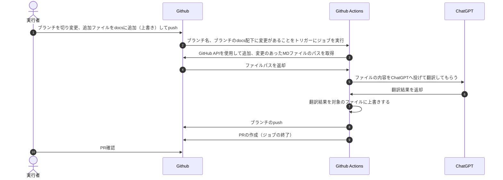

# Automatic Translation Workflow

This document describes the steps to automatically translate Next.js official documentation located in the `docs/app-router` directory using the ChatGPT API. The translated documentation is then placed back into the directory. All the processes are executed via GitHub Actions.

## Processing Flow



## Directory Structure

```bash
Nextjs-docs-ja
├─.github
│  ├─ISSUE_TEMPLATE
│  ├─PULL_REQUEST_TEMPLATE
│  └─workflows
│    └─auto_translate.yml   // GitHub Actionsで実行される処理全体の定義ファイル
├─auto_translate
│  ├─transelate_files_path
│  │ └─transelate_files_path.txt // 翻訳対象のファイルパスを格納する（処理フロー３、４に該当）
│  ├─translate
│  │ └─translate.js // ChatGPT APIを使用して翻訳処理を実行する（処理フロー５、６に該当）
│  └─script
│    ├─check_change.sh   // 追加、変更があったMDファイルの内容をテキストファイルとしてフォルダに格納（処理フロー３、４に該当）
│    └─create_pull_request.sh   // PRの内容を定義してPRを作成する（処理フロー９に該当）
├─docs
├─src
├─static
└─translation-helper
```

## Steps

### 1. Create a Branch

GitHub Actions are triggered by a push to a branch with a specific name format. The branch name format supported is as follows:

```bash
feature/auto-translate-YYYY-MM-DD
```

Create a new branch using this format.

### 2. Place Documents in Directory

Place the files obtained from the official Next.js documentation into the `docs/app-router` directory. If files already exist, overwrite their contents. For new files, place the files in the directory accordingly.

### 3. Push the Branch

Only one PR can be created from the same branch, so if you want to create a PR from the same branch, please merge or close the already existing PR.

Push the changes to the remote repository using the following commands:

```sh
git add .
git commit -m "add new documents"
git push origin feature/auto-translate-YYYY-MM-DD
```

If the process is successful, a pull request (PR) will be created automatically. If it fails, please check the workflow history on GitHub to identify and resolve any issues.
