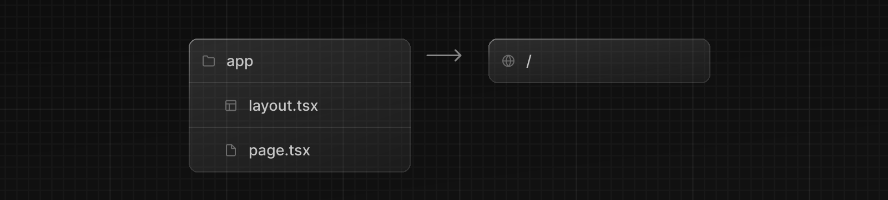

# インストール

システム要件：

- [Node.js 16.8](https://nodejs.org/)以降
- macOS, Windows（WSL 含む）、Linux

## 自動インストール

`create-next-app`を使用して新しい Next.js アプリを作成することをお勧めします。プロジェクトを作成するには以下を実行します。

```bash title="Terminal"
npx create-next-app@latest
```

インストールすると、以下のプロンプトが表示されます：

```bash title="Terminal"
What is your project named? my-app
Would you like to use TypeScript? No / Yes
Would you like to use ESLint? No / Yes
Would you like to use Tailwind CSS? No / Yes
Would you like to use `src/` directory? No / Yes
Would you like to use App Router? (recommended) No / Yes
Would you like to customize the default import alias? No / Yes
```

Next.js では、TypeScript、ESLint、Tailwind CSS の設定がデフォルトで同梱されるようになりました。またアプリケーションコードに`src`ディレクトリを使用できます。

プロンプトの後、`create-next-app`はプロジェクト名のフォルダを作成し、必要な依存関係をインストールします。

## 手動インストール

新しい Next.js アプリを手動で作成するには、必要なパッケージをインストールします：

```bash title="Terminal"
npm install next@latest react@latest react-dom@latest
```

`package.json`を開き、`scripts` に以下を追加してください。

```json title="package.json"
{
  "scripts": {
    "dev": "next dev",
    "build": "next build",
    "start": "next start",
    "lint": "next lint"
  }
}
```

これらのスクリプトは、アプリケーション開発のさまざまな段階を指しています。

- `dev`: `next dev`を実行して、Next.js を開発モードで開始します
- `build`: `next build`を実行して、本番環境用にアプリケーションをビルドします
- `start`: `next start`を実行して、Next.js の本番サーバーを起動します
- `lint`: `next lint`を実行して、Next.js ビルトインの ESLint を設定します

## ディレクトリの作成

Next.js はファイルシステムによるルーティングを使用します。つまり、ファイルをどのように構成するかによって、アプリケーションのルートが決まります。

## `app` ディレクトリ

新しいアプリケーションには、App Router の使用をお勧めします。この Router は、React の最新機能を使うことができ、コミュニティからのフィードバックに基づいて Pages Router を進化させたものです。

App Router を使用するには、`app/`フォルダを作成し、`layout.tsx`と`page.tsx`ファイルを追加します。これらは、ユーザーがアプリケーションのルート（`/`）へアクセスしたときにレンダリングされます。



`app/layout.tsx`内に、必要な`<html>`タグと`<body>`タグを含むルート・レイアウトを作成します：

```tsx title="app/layout.tsx"
export default function RootLayout({
  children,
}: {
  children: React.ReactNode
}) {
  return (
    <html lang="en">
      <body>{children}</body>
    </html>
  )
}
```

最後に、いくつかの初期コンテンツを含むホームページ`app/page.tsx`を作成します：

```tsx title="app/page.tsx"
export default function Page() {
  return <h1>Hello, Next.js!</h1>
}
```

> **Good to know:** `layout.tsx`の作成を忘れても、`next dev`で開発サーバーを実行すると、Next.js が自動的にこのファイルを作成します。

[App Router](/docs/app-router/building-your-application/routing/defining-routes)の使い方についてはこちらをご覧ください。

## `pages`ディレクトリ（任意）

App Router の代わりに Pages Router を使いたい場合は、プロジェクトのルートに`pages/`ディレクトリを作成します。

そして、`pages`フォルダ内に`index.tsx`ファイルを追加します。これがあなたのホームページ（`/`）になります：

```tsx title="pages/index.tsx"
export default function Page() {
  return <h1>Hello, Next.js!</h1>
}
```

次に、グローバル・レイアウトを定義するために、`_app.tsx`ファイルを`pages/`の中に追加します。`App`ファイルをカスタムするには、[こちら](https://nextjs.org/docs/pages/building-your-application/routing/custom-app)を参照してください）。

```tsx title="pages/_app.tsx"
import type { AppProps } from 'next/app'

export default function App({ Component, pageProps }: AppProps) {
  return <Component {...pageProps} />
}
```

最後に、`_document.tsx`ファイルを`pages/`の中に追加し、サーバーからの初期レスポンスを制御します。カスタム`Document`ファイルの詳細については、[こちら](https://nextjs.org/docs/pages/building-your-application/routing/custom-document)を参照してください。

```tsx title="pages/_document.tsx"
import { Html, Head, Main, NextScript } from 'next/document'

export default function Document() {
  return (
    <Html>
      <Head />
      <body>
        <Main />
        <NextScript />
      </body>
    </Html>
  )
}
```

Pages Router の使い方については[こちら](https://nextjs.org/docs/pages/building-your-application/routing/pages-and-layouts)を参照してください。

> **Good to know:** 同じプロジェクトで両方のルーターを使うことはできますが、`app`のルートは`pages`よりも優先されます。混乱を避けるため、新しいプロジェクトでは 1 つのルーターだけを使うことをお勧めします。

## `public`フォルダ（任意）

画像やフォントなどの静的アセットを保存するために、オプションで`public`フォルダを作成きます。`public`ディレクトリ内のファイルは、ベース URL (`/`) で始まるコードから参照できます。

## 開発サーバーの実行

1. `npm run dev`を実行して開発サーバーを起動します
2. http://localhost:3000 にアクセスしてアプリケーションを表示します
3. `app/layout.tsx`（または`pages/index.tsx`）ファイルを編集して保存すると、ブラウザで更新された結果が表示されます
