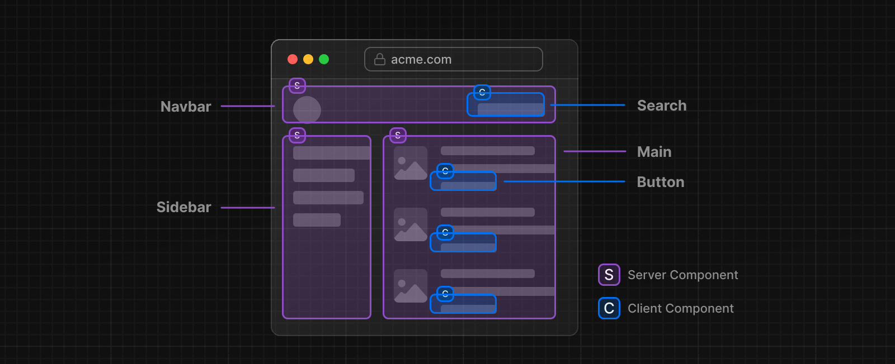

Next.js でアプリケーションを構築するには、Server Components などの React の新機能に慣れておくと便利です。このページでは、Server Components と Client Components の違い、使用するタイミング、推奨パターンについて説明します。

React をはじめて使う場合は、[React Docs](https://ja.react.dev/learn)を参照することもおすすめします。学習に最適なリソースはこちらです。

- [React チュートリアル](https://ja.react.dev/learn/tutorial-tic-tac-toe)
- [React で考える](https://ja.react.dev/learn/thinking-in-react)
- [React を学ぶ](https://ja.react.dev/learn/describing-the-ui)

## Server Components

<!-- textlint-disable -->

Server Components、Client Components により、開発者はサーバーとクライアントにまたがるアプリケーションを構築でき、クライアント側アプリケーションのリッチなインタラクティブ性と、従来のサーバー・レンダリングの改善されたパフォーマンスを組み合わせることができます。

<!-- textlint-enable -->

### Server Components で考える

React が UI 構築の考え方を変えたように、React Server Components は、[サーバーとクライアント](/docs/app-router/building-your-application/rendering#レンダリング環境)を活用するハイブリッドアプリケーション構築の新しいメンタルモデルを紹介します。

<!-- textlint-disable -->

React がアプリケーション全体をクライアントサイドでレンダリングする（シングルページアプリケーションの場合など）代わりに、React ではコンポーネントの目的に応じてレンダリングする場所を柔軟に選択できるようになりました。

<!-- textlint-enable -->

例えば、アプリケーションの [ページ](/docs/app-router/building-your-application/routing/pages-and-layouts#ページ) を考えてみます。



ページを小さなコンポーネントに分割してみると、大半のコンポーネントは非インタラクティブで、Server Component としてサーバー上でレンダリングできることに気づくでしょう。インタラクティブな UI のパーツには、Client Component を*散りばめる*ことができます。これは、Next.js のサーバーファーストのアプローチに沿ったものです。

### なぜ Server Components なのか？

では、なぜ Server Components なのでしょうか？Client Component よりも Server Component を使うメリットは何でしょうか？

<!-- textlint-disable -->

Server Components を使うと、開発者はサーバーのインフラをよりよく活用できるようになります。例えば、データの取得をサーバーに移し、データベースに近づけることができます。また従来はクライアントの JavaScript バンドルサイズに影響を与えていた大きな依存関係をサーバーに残すことができ、パフォーマンスの向上につながります。Server Components は、React アプリケーションを PHP や Ruby on Rails に近い感覚で書くことができますが、React のパワーと柔軟性、UI をテンプレート化するコンポーネントモデルを備えています。

<!-- textlint-enable -->

Server Components を使用すると、最初のページロードが速くなり、クライアントサイドの JavaScript バンドルサイズが縮小されます。クライアントサイドの基本的なランタイムは、**キャッシュ可能**かつ**予測可能**なサイズであり、アプリケーションの成長に合わせて増加することはありません。追加の JavaScript は、アプリケーションで[Client Components](#client-components)を使用してクライアント側とのインタラクション機能を使用する場合にのみ、追加されます。

<!-- textlint-disable -->

Next.js でルートがロードされると、最初の HTML がサーバー上でレンダリングされます。この HTML は、Next.js と React のクライアントサイド・ランタイムを非同期にロードすることで、クライアントがアプリケーションを引き継ぎ、インタラクティブ性を追加できるようにブラウザで徐々に拡張されます。

<!-- textlint-enable -->

<!-- textlint-disable -->

Server Components への移行を容易にするため、[App Router](/docs/app-router/building-your-application/routing#app-router) 内のすべてのコンポーネントは、デフォルトで Server Components となっており、[特殊なファイル](/docs/app-router/building-your-application/routing#ファイル規約) や [コロケートされたコンポーネント](/docs/app-router/building-your-application/routing#コロケーション) も含みます。これにより、余分な作業をすることなく自動的にそれらを採用し、すぐに素晴らしいパフォーマンスを実現できます。また['use client'ディレクティブ](#use-clientディレクティブ) を使えば、オプションで Client Component を選択できます。

<!-- textlint-enable -->

## Client Components

Client Components を使用すると、アプリケーションにクライアントサイドのインタラクティブ性を追加できます。Next.js では Client Components であっても、サーバー側でプリレンダリングして、クライアント側でハイドレートできます。Client Component は、[Pages Router](https://nextjs.org/docs/pages)のコンポーネントと同じ様に考えることができます。

### "use client"ディレクティブ

[`"use client"`ディレクティブ](https://github.com/reactjs/rfcs/pull/227) は、Server Components と Client Components のモジュールグラフの境界を宣言するための規約です。

```tsx title="app/counter.tsx" highlight={1}
'use client'

import { useState } from 'react'

export default function Counter() {
  const [count, setCount] = useState(0)

  return (
    <div>
      <p>You clicked {count} times</p>
      <button onClick={() => setCount(count + 1)}>Click me</button>
    </div>
  )
}
```


`"use client"`は、サーバーのみのコードとクライアントのコードの間に位置します。これは、ファイルの一番上、import 文の上に置かれ、サーバー側のコードからクライアント部分への境界を越える*カットオフ*ポイントを定義します。ファイルに `"use client"` が宣言されると、子コンポーネントを含む、そのファイルにインポートされた他のすべてのモジュールは、クライアントのバンドルに含まれるとみなされます。

<!-- textlint-disable -->

Server Component がデフォルトなので、`"use client"`で始まるモジュールとして定義またはインポートされない限り、すべてのコンポーネントは Server Component のモジュールグラフの一部となります。

<!-- textlint-enable -->

> **Good to know:**
>
> - Server Component モジュールグラフのコンポーネントは、サーバ上でのみレンダリングされることが保証されています
> - Client Component モジュールグラフのコンポーネントは、主にクライアントでレンダリングされますが、Next.js では、サーバーでプリレンダリングして、クライアントでハイドレートすることもできます
> - `"use client"`は、インポートする前に、ファイルの**先頭で定義する必要があります**
> - `"use client"`は、すべてのファイルで定義する必要は **ありません**。Client モジュールの境界は、「エントリーポイント」で一度だけ定義すれば、そこにインポートされるすべてのモジュールが Client Component とみなされます

## Server Component と Client Component をいつ使うか

<!-- textlint-disable -->

Server Components と Client Components の使い分けを簡単にするため、Client Components のユースケースが決まるまでは、Server Component（デフォルトは`app`ディレクトリ）を使用することをお勧めします。

<!-- textlint-enable -->

この表は、Server Components と Client Components の異なるユースケースをまとめたものです。

| 何をする必要があるのか                                                                           | Server Component | Client Component |
| :----------------------------------------------------------------------------------------------- | :--------------- | :--------------- |
| データをフェッチする                                                                             | ✅               | ×                |
| バックエンドリソースにアクセスする（直接）                                                       | ✅               | ×                |
| 機密情報をサーバーに保持する（アクセストークン、API キーなど）                                   | ✅️              | ×                |
| 大きな依存関係をサーバーに残す / クライアントサイドの JavaScript を削減する                      | ✅️              | ×                |
| インタラクティブ性とイベントリスナーを追加する (`onClick()`, `onChange()`, etc.)                 | ×                | ✅️              |
| ステートとライフサイクルエフェクトを使用する (`useState()`, `useReducer()`, `useEffect()`, etc.) | ×                | ✅️              |
| ブラウザ専用の API を使用する                                                                    | ×                | ✅️              |
| ステート、エフェクト、またはブラウザ専用の API に依存するカスタムフックを使用する                | ×                | ✅️              |
| [React クラスコンポーネント](https://ja.react.dev/reference/react/Component)を使用する。         | ×                | ✅️              |

## パターン

### Client Component を葉に移動する

アプリケーションのパフォーマンスを向上させるために、可能な限り Client Component をコンポーネントツリーの葉に移動させることをお勧めします。

例えば、静的な要素（ロゴ、リンクなど）を持つレイアウトと、状態を使用する対話型の検索バーがあるとします。

<!-- textlint-disable -->

レイアウト全体を Client Component にするのではなく、インタラクティブなロジックを Client Component（例：`<SearchBar />`）に移動し、レイアウトは Server Component として維持します。つまりレイアウトのすべてのコンポーネントの JavaScript コードをクライアントに送信する必要がなくなります。

<!-- textlint-enable -->

```jsx title="app/layout.tsx"
// SearchBarはClient Component
import SearchBar from './searchbar'
// LogoはServer Component
import Logo from './logo'

// LayoutはデフォルトでServer Component
export default function Layout({ children }) {
  return (
    <>
      <nav>
        <Logo />
        <SearchBar />
      </nav>
      <main>{children}</main>
    </>
  )
}
```

### Client Component と Server Component を構成する

Server Component と Client Component は、同じコンポーネントツリーで組み合わせることができます。

裏側では、React は次のようにレンダリングを処理します：

- サーバー上では、React は結果をクライアントへ送信する前に**すべての**Server Components をレンダリングする
  - Client Component の中にネストされた Server Component も含まれます
  - この段階で遭遇した Client Component はスキップされます
- クライアント側では、React が Client Component をレンダリングし、Server Components のレンダリング結果をスロットインして、サーバーとクライアントで行われた作業を統合する
  - Server Component が Client Component の中にネストされている場合、レンダリングされたコンテンツは Client Component の中に正しく配置されます

> **Good to know:** Next.js では、最初のページロード時に、上記のステップでレンダリングされた Server Components と Client Component の両方がサーバー上で HTML としてプリレンダリングされて、最初のページロードが速くなるようになっています。

### Client Component の中に Server Component を入れ込む

上記のレンダリングフローを考慮すると、Server Component を Client Component にインポートする場合、サーバーのラウンドトリップを追加する必要があるため、制約があります。

#### サポートされていないパターン： Server Component を Client Component にインポートする

以下のパターンはサポートされていません。Server Component は Client Component にインポートできません。

```tsx title="app/example-client-component.tsx" highlight={5,18}
'use client'

// このパターンは動作**しません**！
// Client ComponentにServer Componentはインポートできません
import ExampleServerComponent from './example-server-component'

export default function ExampleClientComponent({
  children,
}: {
  children: React.ReactNode
}) {
  const [count, setCount] = useState(0)

  return (
    <>
      <button onClick={() => setCount(count + 1)}>{count}</button>

      <ExampleServerComponent />
    </>
  )
}
```

#### 推奨パターン：Server Component を Props として Client Component に渡す

Client Component を設計する際に、React props を使用して Server Component のための*"スロット"*をマークできます。

<!-- textlint-disable -->

Server Component はサーバー上でレンダリングされ、Client Component がクライアント上でレンダリングされると、*"スロット"*は Server Component のレンダリング結果で埋められます。

<!-- textlint-enable -->

<!-- textlint-disable -->

よくあるパターンは、React の `children` prop を使って _"スロット"_ を作成することです。`<ExampleClientComponent>`をリファクタリングして、一般的な `children` を受け付けるようにし、`<ExampleClientComponent>`のインポートと明示的なネストを親コンポーネントに移動させます。

<!-- textlint-enable -->

```tsx title="app/example-client-component.tsx" highlight={6,16}
'use client'

import { useState } from 'react'

export default function ExampleClientComponent({
  children,
}: {
  children: React.ReactNode
}) {
  const [count, setCount] = useState(0)

  return (
    <>
      <button onClick={() => setCount(count + 1)}>{count}</button>

      {children}
    </>
  )
}
```

`<ExampleClientComponent>`は`children`が何であるかは知りません。`children`が最終的に Server Component の結果で埋められることすら知らないのです。

`ExampleClientComponent`が持つ唯一の責任は、最終的に`children`がどこに配置されるかを決定することです。

<!-- textlint-disable -->

親となる Server Component では、`<ExampleClientComponent>` と `<ExampleServerComponent>` の両方をインポートして、`<ExampleClientComponent>` の`children`として `<ExampleServerComponent>` を渡します。

<!-- textlint-enable -->

```tsx title="app/page.tsx"  highlight={10}
// このパターンは動作します：
// Server ComponentをClient Componentの子またはpropとして渡すことができます
import ExampleClientComponent from './example-client-component'
import ExampleServerComponent from './example-server-component'

// Pages in Next.js are Server Components by default
export default function Page() {
  return (
    <ExampleClientComponent>
      <ExampleServerComponent />
    </ExampleClientComponent>
  )
}
```

<!-- textlint-disable -->

この方法では、`<ExampleClientComponent>`と`<ExampleServerComponent>`のレンダリングが切り離され、サーバーで Client Component の前にレンダリングされる Server Component と独立してレンダリングされます。

<!-- textlint-enable -->

> **Good to know:**
>
> - このパターンは、[ページとレイアウト](/docs/app-router/building-your-application/routing/pages-and-layouts) の `children` prop ですでに適用されているので、追加のラッパーコンポーネントを作成する必要はない
> - React コンポーネント（JSX）を他のコンポーネントに渡すことは、新しい概念ではなく、常に React のコンポジションモデルの一部です
> - このコンポジション戦略は、コンポーネントは渡された prop が**何**であるかについて知らないため、Server Component と Client Component にまたがって機能します。渡されたものがどこに配置されるべきかについてのみ責任を持ちます
>   - そのため、Client Component がクライアント側でレンダリングされる前に、渡された prop がサーバー上で独立してレンダリングされることになります
>   - 「lifting content up」というまったく同じ戦略は、親コンポーネントの状態変化によって、インポートしネストされた子コンポーネントの再レンダリングを回避するために使用されています
> - `children` プロップに限定されるわけではありません。JSX を渡すために、どのようなプロップでも使用することができます

### Server から Client Components へ prop を渡す（Serialization）

Server から Client Components に渡す prop は、[シリアライズ可能](https://developer.mozilla.org/en-US/docs/Glossary/Serialization)である必要があります。つまり、関数や日付などの値は、Client Component に直接渡すことはできません。

> ネットワークの境界はどこですか？
>
> App Router では、Server Component と Client Component がネットワークの境界となります。これは、`getStaticProps`/`getServerSideProps`と Page Components の間に境界がある Pages とは異なります。Server Component 内で取得したデータは、Client Component に渡されない限り、ネットワーク境界を越えることはないので、シリアライズする必要はありません。Server Components でのデータ取得について、詳しくは[こちら](/docs/app-router/building-your-application/data-fetching/patterns#サーバー上でのデータフェッチ)を参照してください。

### Client Component からサーバーのみのコードを排除する(Poisoning)

<!-- textlint-disable -->

JavaScript のモジュールは Server Component と Client Component の両方で共有できるため、サーバーで実行されることを想定したコードがクライアントに紛れ込む可能性があります。

<!-- textlint-enable -->

例えば、次のようなデータフェッチの関数があります：

```ts title="lib/data.ts"
export async function getData() {
  const res = await fetch('https://external-service.com/data', {
    headers: {
      authorization: process.env.API_KEY,
    },
  })

  return res.json()
}
```

一見すると、`getData`はサーバーとクライアントの両方で動作するように見えます。しかし、環境変数`API_KEY`の先頭に`NEXT_PUBLIC`が付いていないため、サーバーでのみアクセス可能なプライベート変数となっています。Next.js では、セキュアな情報の漏洩を防ぐため、クライアントコードではプライベートな環境変数を空文字列に置き換えています。

その結果、クライアントで `getData()` をインポートして実行しても、期待通りに動作しません。また変数をパブリックにすれば、クライアント上で関数が動作するようになりますが、セキュアな情報が漏れてしまうことになります。

そのため、この関数はサーバー上でのみ実行されることを想定して書かれています。

### `server-only`パッケージ

<!-- textlint-disable -->

このような意図しないクライアントでのサーバーコードの利用を防ぐために、`server-only`パッケージを使用することで、他の開発者が誤ってこれらのモジュールを Client Component にインポートした場合、ビルド時にエラーを出すことができます。

<!-- textlint-enable -->

`server-only`を使用するには、まずこのパッケージをインストールします。

```bash title="Terminal"
npm install server-only
```

次に、サーバーでのみ動作するコードを含むモジュールに、このパッケージをインポートします。

```js title="lib/data.js"
import 'server-only'

export async function getData() {
  const res = await fetch('https://external-service.com/data', {
    headers: {
      authorization: process.env.API_KEY,
    },
  })

  return res.json()
}
```

これで、`getData()`をインポートした Client Component は、このモジュールはサーバー上でのみ使用できることを説明するビルド時エラーを受け取ることになります。

対応するパッケージ `client-only` は、クライアント専用のコード、例えば `window` オブジェクトにアクセスするコードを含むモジュールをマークするために使用できます。

### データフェッチ

Client Component でデータを取得が可能ですが、クライアントでデータを取得する特殊な理由がない限り、Server Component でデータを取得することをお勧めします。データ取得をサーバーに移行することで、パフォーマンスとユーザーエクスペリエンスの向上につながります。

[データフェッチについての詳細はこちら](/docs/app-router/building-your-application/data-fetching)

### サードパーティ・パッケージ

<!-- textlint-disable -->

Server Components は新しいものなので、エコシステムのサードパーティ・パッケージは `useState`, `useEffect`, `createContext` のようなクライアント専用の機能を使用するコンポーネントに `"use client"` ディレクティブを追加し始めたばかりです。

<!-- textlint-enable -->

<!-- textlint-disable -->

今日、`npm` パッケージから提供されているクライアント専用の機能を使用するコンポーネントの多くは、まだこのディレクティブを持っていません。このようなサードパーティ製コンポーネントは、`"use client"`ディレクティブを持っているあなたの[Client Components](#client-components) 内では期待通りに動作しますが、Server Components 内では動作しないでしょう。

<!-- textlint-enable -->

例えば、架空の `acme-carousel` パッケージをインストールし、その中に `<Carousel />` コンポーネントがあるとしましょう。このコンポーネントは `useState` を使用しますが、まだ `"use client"` を持ちません。

Client Component の中で `<Carousel />` を使用する分には、期待通りに動作します。

```tsx title="app/gallery.tsx"
'use client'

import { useState } from 'react'
import { Carousel } from 'acme-carousel'

export default function Gallery() {
  let [isOpen, setIsOpen] = useState(false)

  return (
    <div>
      <button onClick={() => setIsOpen(true)}>View pictures</button>

      {/* CarouselはClient Component内にあるので、これは動作する */}
      {isOpen && <Carousel />}
    </div>
  )
}
```

しかし、Server Component 内で直接使用しようとすると、エラーが表示されます。

```tsx title="app/page.tsx"
import { Carousel } from 'acme-carousel'

export default function Page() {
  return (
    <div>
      <p>View pictures</p>

      {/* Error: `useState` can not be used within Server Components */}
      <Carousel />
    </div>
  )
}
```

これは、Next.js が `<Carousel />` がクライアント専用機能を使用していることを認識していないためです。

これを解決するには、クライアント専用機能に依存するサードパーティ製コンポーネントを、独自の Client Component で囲むとよいでしょう。

```tsx title="app/carousel.tsx"
'use client'

import { Carousel } from 'acme-carousel'

export default Carousel
```

これで、Server Component 内で直接`<Carousel />`を使用できるようになりました。

```tsx title="app/page.tsx"
import Carousel from './carousel'

export default function Page() {
  return (
    <div>
      <p>View pictures</p>

      {/* CarouselはClient Component内にあるので、これは動作する */}
      <Carousel />
    </div>
  )
}
```

サードパーティ製のコンポーネントは、Client Component 内で使用することが多いので、ラップする必要はないと考えています。ただし、プロバイダコンポーネントは React の状態と context に依存しており、通常アプリケーションのルートで必要とされるため、1 つの例外となります。[サードパーティコンテキストプロバイダーについては後述します](#server-component-でサードパーティーの-context-プロバイダーをレンダリングする).

#### ライブラリ作者

- 同様に、他の開発者が使用するパッケージを作成するライブラリの作者は、`"use client"`ディレクティブを使用して、パッケージのクライアントエントリポイントをマーできます。これにより、パッケージの利用者は、ラッピング境界を作成することなく、パッケージのコンポーネントを直接 Server Component にインポートできます。
- [ツリーのより深い位置で`"use client"`](#client-component-を葉に移動する)を使用することで、インポートしたモジュールを Server Component のモジュールグラフの一部にでき、パッケージを最適化できます。
- バンドルによっては`"use client"`ディレクティブを削除してしまうことがあります。esbuild で`"use client"`ディレクティブをインクルードする設定方法の例は[React Wrap Balancer](https://github.com/shuding/react-wrap-balancer/blob/main/tsup.config.ts#L10-L13)と[Vercel Analytics](https://github.com/vercel/analytics/blob/main/packages/web/tsup.config.js#L26-L30)のリポジトリにあります。

## Context

ほとんどの React アプリケーションは、コンポーネント間でデータを共有するため[context](https://ja.react.dev/reference/react/useContext)に依存しています。[`createContext`](https://ja.react.dev/reference/react/useContext)によって直接、またはサードパーティライブラリからインポートしたプロバイダーコンポーネントによって間接的にデータを共有します。

<!-- textlint-disable -->

Next.js 13 でも Client Component では context が完全にサポートされていますが、Server Component では context を直接作成・使用**できません**。これは、Server Component には React の状態がなく（インタラクティブでないため）、context は主に、React の状態が更新された後にツリーの奥にあるインタラクティブなコンポーネントを再レンダリングするために使用されるからです。

<!-- textlint-enable -->

Server Components 間でデータを共有する方法については後述しますが、まずは Client Components 内で context を使用する方法について説明します。

### Client Component での context の使用

Client Components 内では、すべての Context API が完全にサポートされています。

```tsx title="app/sidebar.tsx"
'use client'

import { createContext, useContext, useState } from 'react'

const SidebarContext = createContext()

export function Sidebar() {
  const [isOpen, setIsOpen] = useState()

  return (
    <SidebarContext.Provider value={{ isOpen }}>
      <SidebarNav />
    </SidebarContext.Provider>
  )
}

function SidebarNav() {
  let { isOpen } = useContext(SidebarContext)

  return (
    <div>
      <p>Home</p>

      {isOpen && <Subnav />}
    </div>
  )
}
```

しかし、context の Provider はグローバルな関心事を共有するために通常アプリケーションのルート付近でレンダリングされます。
Server Components では context はサポートされていないため、アプリケーションのルートで Context を作成しようとすると、エラーが発生します。

```tsx title="app/layout.tsx"
import { createContext } from 'react'

// createContextはServer Componentではサポートされていない
export const ThemeContext = createContext({})

export default function RootLayout({ children }) {
  return (
    <html>
      <body>
        <ThemeContext.Provider value="dark">{children}</ThemeContext.Provider>
      </body>
    </html>
  )
}
```

これを解決するには、Context を作成し、そのプロバイダを Client Component の中にレンダリングします。

```tsx title="app/theme-provider.tsx"
'use client'

import { createContext } from 'react'

export const ThemeContext = createContext({})

export default function ThemeProvider({ children }) {
  return <ThemeContext.Provider value="dark">{children}</ThemeContext.Provider>
}
```

Server Component は、プロバイダが Client Component としてマークされたので、プロバイダを直接レンダリングできるようになります。

```tsx title="app/layout.tsx"
import ThemeProvider from './theme-provider'

export default function RootLayout({
  children,
}: {
  children: React.ReactNode
}) {
  return (
    <html>
      <body>
        <ThemeProvider>{children}</ThemeProvider>
      </body>
    </html>
  )
}
```

プロバイダがルートにレンダリングされると、アプリ内の他のすべての Client Component がこの Context を利用できます。

> Good to know: プロバイダはできるだけツリーの深い部分にレンダリングするべきです。`ThemeProvider`が`<html>`ドキュメント全体ではなく、`{children}`のみをラップしていることに注目してください。これにより、Next.js は Server Components の静的な部分を最適化しやすくなります。

### Server Component でサードパーティーの Context プロバイダーをレンダリングする

サードパーティの npm パッケージには、アプリケーションのルート付近でレンダリングする必要があるプロバイダを含んでいることがよくあります。これらのプロバイダが `"use client"` ディレクティブを含んでいれば、Server Components の内部で直接レンダリングできます。しかし、Server Components は非常に新しいものなので、多くのサードパーティのプロバイダはまだこのディレクティブを追加していないでしょう。

`use client"`を持たないサードパーティのプロバイダをレンダリングしようとすると、エラーになります。

```tsx title="app/layout.tsx"
import { ThemeProvider } from 'acme-theme'

export default function RootLayout({ children }) {
  return (
    <html>
      <body>
        {/*  Error: `createContext` can't be used in Server Components */}
        <ThemeProvider>{children}</ThemeProvider>
      </body>
    </html>
  )
}
```

この問題を解決するには、サードパーティーのプロバイダーを独自の Client Component で囲む必要があります。

```jsx title="app/providers.js"
'use client'

import { ThemeProvider } from 'acme-theme'
import { AuthProvider } from 'acme-auth'

export function Providers({ children }) {
  return (
    <ThemeProvider>
      <AuthProvider>{children}</AuthProvider>
    </ThemeProvider>
  )
}
```

これで、ルートレイアウト内で `<Providers />` を直接インポートしてレンダリングできるようになりました。

```jsx title="app/layout.js"
import { Providers } from './providers'

export default function RootLayout({ children }) {
  return (
    <html>
      <body>
        <Providers>{children}</Providers>
      </body>
    </html>
  )
}
```

プロバイダをツリーのルートでレンダリングすることで、これらのライブラリのすべてのコンポーネントとフックが、Client Component の中で期待通りに動作します。

サードパーティ・ライブラリがクライアントコードに `"use client"` を追加したら、ラッパーとなる Client Component を削除できるようになります。

### Server Components 間のデータ共有

Server Components はインタラクティブではないので、React の状態を読み取ることはありません。そのため、データを共有するために Context は必要ありません。その代わり、複数の Server Components がアクセスする必要のある共通のデータには、ネイティブの JavaScript パターンを使用できます。たとえば、モジュールを使用して、複数のコンポーネントでデータベース接続を共有できます：

```ts title="utils/database.ts"
export const db = new DatabaseConnection()
```

```tsx title="app/users/layout.tsx"
import { db } from '@utils/database'

export async function UsersLayout() {
  let users = await db.query()
  // ...
}
```

```tsx title="app/users/[id]/page.tsx"
import { db } from '@utils/database'

export async function DashboardPage() {
  let user = await db.query()
  // ...
}
```

上記の例では layout と page の両方がデータベースへ問い合わせる必要があります。これらのコンポーネントは、それぞれ `@utils/database` モジュールをインポートすることで、データベースへのアクセスを共有します。この JavaScript のパターンはグローバル・シングルトンと呼ばれています。

### Server Component 間での fetch リクエストの共有

データを fetch するとき、`page`や`layout`とその children との間で`fetch`の結果を共有したい場合があります。これはコンポーネント間の不要な結合であり、コンポーネント間で `props` を行き来させることにつながります。

その代わりに、データを利用するコンポーネントと一緒にデータ・フェッチのコードをコロケーションすることをお勧めします。Server Component では、`fetch`リクエストは自動的に重複排除されるので、それぞれのルート Segment は重複したリクエストを心配することなく、まさに必要なデータをリクエストできます。Next.js は、`fetch`キャッシュから同じ値を読み取ります。
