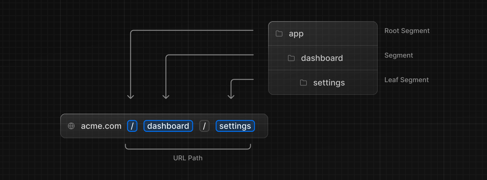
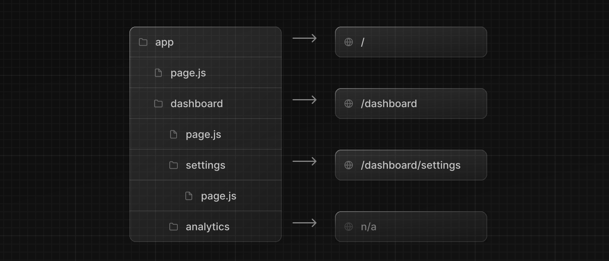

> [ルーティングの基本](/docs/app-router/building-your-application/routing)のページを先に読むことをおすすめします。

このページでは、Next.js アプリケーションでどのようにルートを定義し、整理するかを説明します。

## ルートの作成

Next.js では、**フォルダ**を使ってルートを定義する、ファイルシステムベースの Router を使います。

各フォルダは、**URL** Segment にマッピングされる[**ルート** セグメント](/docs/app-router/building-your-application/routing#ルート-segment)を表します。[入れ子になったルート](/docs/app-router/building-your-application/routing#ネストされたルート)を作成するには、フォルダ同士を入れ子にします。



特殊な[`page.js`ファイル](/docs/app-router/building-your-application/routing/pages-and-layouts#ページ)はルート Segment を一般公開するために使われます。



この例では、`/dashboard/analytics`の URL パスは、対応する`page.js`ファイルを持っていないため、一般にはアクセスできません。このフォルダは、コンポーネント、スタイルシート、画像、またはその他の配置されたファイルを保存するために使用できます。

> **Good to know:** `.js`、`.jsx`、または`.tsx`ファイル拡張子は、特別なファイルに使用できます。

## UI の作成

[特別なファイル規約](/docs/app-router/building-your-application/routing/#ファイル規約)は、各ルート Segment の UI を作成するために使用されます。もっとも一般的なものは、ルートに固有の UI を表示する[pages](/docs/app-router/building-your-application/routing/pages-and-layouts#ページ)と、複数のルートで共有される UI を表示する[layouts](/docs/app-router/building-your-application/routing/pages-and-layouts#レイアウト)です。

例えば、最初のページを作成するには、`app`ディレクトリ内に`page.js`ファイルを追加し、React コンポーネントをエクスポートします：

```tsx title="app/page.tsx" switcher
export default function Page() {
  return <h1>Hello, Next.js!</h1>
}
```
