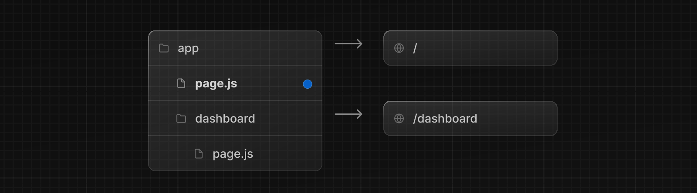
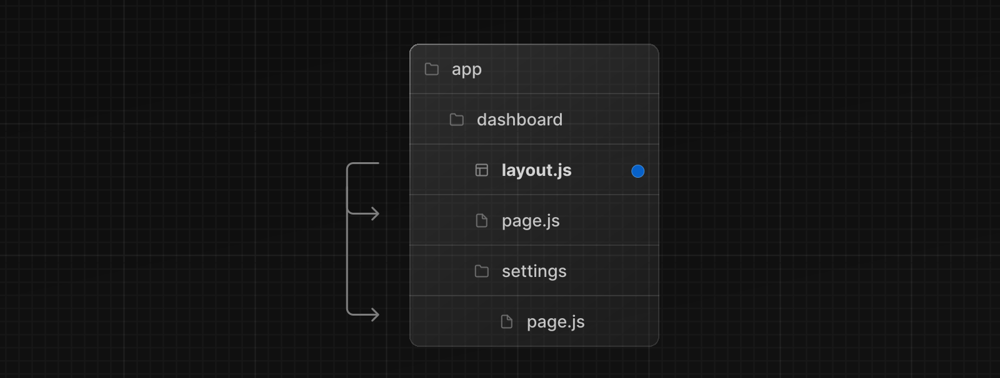
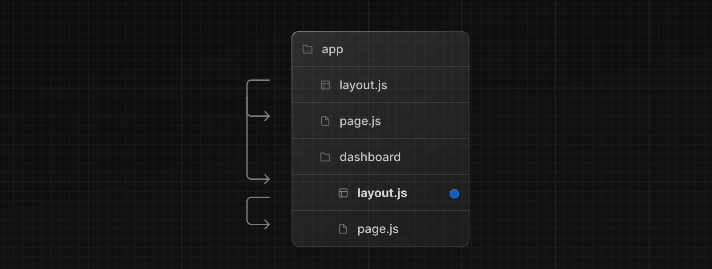
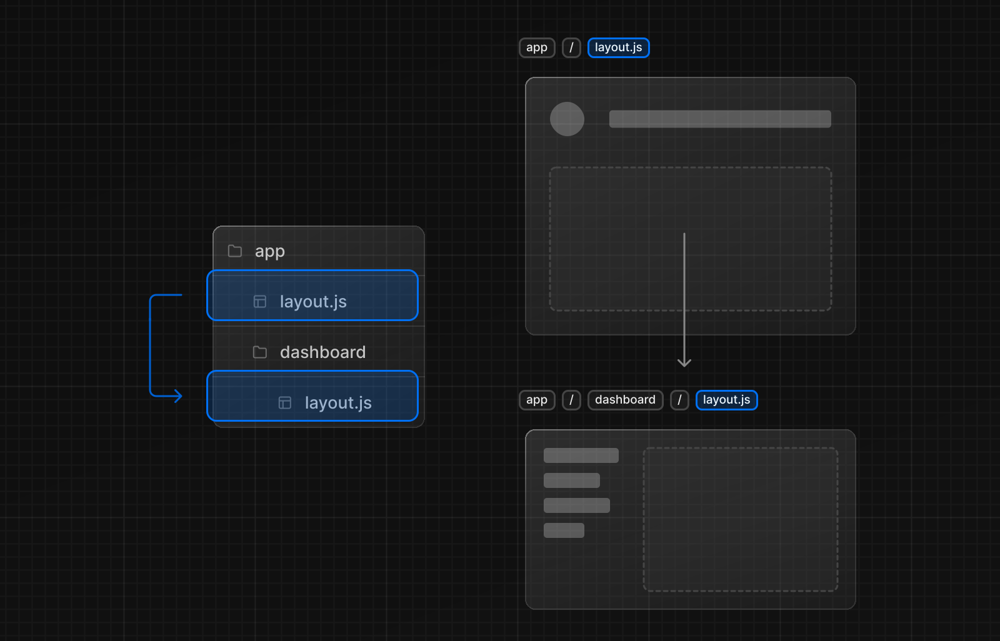

> [ルーティングの基礎](/docs/app-router/building-your-application/routing)と[ルーティングの定義](/docs/app-router/building-your-application/routing/defining-routes)のページを先に読むことをお勧めします。

Next.js 13 の App Router では、[ページ](#ページ)、[共有レイアウト](#レイアウト)、[テンプレート](#テンプレート)を簡単に作成できる新しいファイル規約が導入されました。このページでは、Next.js アプリケーションでこれらの特殊ファイルを使う方法を説明します。

## ページ

ページとは、ルートに固有の UI です。`page.js`ファイルからコンポーネントをエクスポートすることで、ページを定義できます。ネストされたフォルダを使用して[ルートを定義](/docs/app-router/building-your-application/routing/defining-routes)し、`page.js`ファイルを使用してルートに一般的にアクセスできるようにします。

`app`ディレクトリ内に `page.js` ファイルを追加して、最初のページを作成します：



```tsx title="app/page.tsx"
// `app/page.tsx` is the UI for the `/` URL
export default function Page() {
  return <h1>Hello, Home page!</h1>
}
```

```tsx title="app/dashboard/page.tsx"
// `app/dashboard/page.tsx` is the UI for the `/dashboard` URL
export default function Page() {
  return <h1>Hello, Dashboard Page!</h1>
}
```

> **Good to know:**
>
> - ページは常に[ルートサブツリー](/docs/app-router/building-your-application/routing#用語解説)の[リーフ](/docs/app-router/building-your-application/routing#用語解説)です。
> - `.js`, `.jsx`, `.tsx` の拡張子をページに使用することができます。
> - `page.js` ファイルはルートセグメントを一般公開するために必要です。
> - ページはデフォルトでは[Server Components](/docs/app-router/building-your-application/rendering/server-components)ですが、[Client Component](/docs/app-router/building-your-application/rendering/client-components)に設定することもできます。
> - ページはデータをフェッチすることができます。詳細は[Data Fetching](/docs/app-router/building-your-application/data-fetching)セクションを参照してください。

## レイアウト

レイアウトは、複数のページ間で**共有**される UI です。ナビゲーションの際、レイアウトは状態を保持し、インタラクティブであり続け、再レンダリングしません。レイアウトは[入れ子](#レイアウトの入れ子)にすることもできます。
レイアウトを定義するには、`layout.js`ファイルから`default` React コンポーネントをエクスポートします。このコンポーネントは `children` prop を受け取る必要があり、レンダリング時に子レイアウト（存在する場合）または子ページが入力されます。



```tsx title="app/dashboard/layout.tsx"
export default function DashboardLayout({
  children, // will be a page or nested layout
}: {
  children: React.ReactNode
}) {
  return (
    <section>
      {/* Include shared UI here e.g. a header or sidebar */}
      <nav></nav>

      {children}
    </section>
  )
}
```

> **Good to know:**
>
> - 一番上のレイアウトは[ルートレイアウト](#ルートレイアウト-必須)と呼ばれます。この**必須**レイアウトは、アプリケーション内のすべてのページで共有されます。ルートレイアウトは `html` と `body` タグを含まなければなりません。
> - 任意のルートセグメントはオプションで独自の[Layout](#レイアウトの入れ子)を定義することができます。これらのレイアウトはそのセグメント内のすべてのページで共有されます。
> - ルート内のレイアウトはデフォルトで **入れ子** になっています。それぞれの親レイアウトは、React の `children` prop を使用して、その下の子レイアウトをラップします。
> - [Route Groups](/docs/app-router/building-your-application/routing/route-groups)を使って、特定のルートセグメントを共有レイアウトに入れたり入れたりすることができます。
> - レイアウトはデフォルトでは[Server Components](/docs/app-router/building-your-application/rendering/server-components)ですが、[Client Component](/docs/app-router/building-your-application/rendering/client-components)に設定することができます。
> - レイアウトはデータをフェッチすることができます。詳細は[Data Fetching](/docs/app-router/building-your-application/data-fetching)セクションを参照してください。
> - 親レイアウトとその子レイアウトの間でデータを渡すことはできません。しかし、ルート内で同じデータを複数回フェッチすることは可能で、React はパフォーマンスに影響を与えることなく[リクエストを自動的にデデュープ](/docs/app-router/building-your-application/caching)します。
> - レイアウトは現在のルートセグメントにアクセスできません。ルートセグメントにアクセスするには、クライアントコンポーネントで[`useSelectedLayoutSegment`](/docs/app-router/api-reference/functions/use-selected-layout-segment)または[`useSelectedLayoutSegments`](/docs/app-router/api-reference/functions/use-selected-layout-segments)を使うことができます。
> - `.js`, `.jsx`, `.tsx` の拡張子をレイアウトに使用することができます。
> - `layout.js` と `page.js` ファイルを同じフォルダに定義することができます。レイアウトはページをラップします。

### ルートレイアウト (必須)

ルートレイアウトは `app` ディレクトリのトップレベルで定義され、すべてのルートに適用されます。このレイアウトによってサーバーから返される最初の HTML を修正できます。

```tsx title="app/layout.tsx"
export default function RootLayout({
  children,
}: {
  children: React.ReactNode
}) {
  return (
    <html lang="en">
      <body>{children}</body>
    </html>
  )
}
```

> **Good to know:**
>
> - `app`ディレクトリにはルートレイアウトが必要です。
> - ルートレイアウトには、`<html>`タグと`<body>`タグを定義する必要があります。
> - [ビルドイン SEO サポート](/docs/app-router/building-your-application/optimizing/metadata)を使って、`<head>` HTML 要素、たとえば`<title>`要素を管理することができます。
> - [ルートグループ](/docs/app-router/building-your-application/routing/route-groups)を使って複数のルートレイアウトを作成することができます。例は[こちら](/docs/app-router/building-your-application/routing/route-groups#複数のルートレイアウトを作成する)を参照してください。
> - ルートレイアウトはデフォルトでは[Server Component](/docs/app-router/building-your-application/rendering/server-components)であり、[Client Component](/docs/app-router/building-your-application/rendering/client-components)には**設定できません**。

> **`pages`ディレクトリからの移行:** ルートレイアウトは[`_app.js`](https://nextjs.org/docs/pages/building-your-application/routing/custom-app)と[`_document.js`](https://nextjs.org/docs/pages/building-your-application/routing/custom-document)ファイルを置き換えます。[移行ガイドを見る](/docs/app-router/building-your-application/upgrading/app-router-migration#migrating-_documentjs-and-_appjs)。

### レイアウトの入れ子

フォルダ内で定義されたレイアウト (例 `app/dashboard/layout.js`) は特定のルート Segment (例 `acme.com/dashboard`) に適用され、それらの Segment がアクティブなときにレンダリングされます。デフォルトでは、ファイル階層内のレイアウトは **nested** で、`children` プロップを通して子レイアウトをラップします。



```tsx title="app/dashboard/layout.tsx"
export default function DashboardLayout({
  children,
}: {
  children: React.ReactNode
}) {
  return <section>{children}</section>
}
```

> **Good to know:**
>
> - ルートレイアウトだけが`<html>`タグと`<body>`タグを含むことができます。

上記の 2 つのレイアウトを組み合わせるとすると、ルートレイアウト（`app/layout.js`）はダッシュボードレイアウト（`app/dashboard/layout.js`）をラップし、ルート Segment は `app/dashboard/*` 内でラップされます。

2 つのレイアウトはこのように入れ子になります。



[Route Groups](/docs/app-router/building-your-application/routing/route-groups)を使って、特定のルート Segment を共有レイアウトに出し入れできます。

## テンプレート

テンプレートは各子レイアウトやページをラップするという点で、レイアウトに似ています。ルートにまたがって永続的に状態を維持するレイアウトとは異なり、テンプレートはナビゲーションの際に子要素ごとに新しいインスタンスを生成します。つまり、ユーザーがテンプレートを共有するルート間をナビゲートすると、コンポーネントの新しいインスタンスがマウントされ、DOM 要素が再作成され、ステートは**保存されず**、エフェクトは再同期されます。

そのような特定の動作が必要な場合があり、テンプレートはレイアウトよりも適切なオプションです。例えば

- `useEffect`に依存する機能（ページビューのロギングなど）や `useState`に依存する機能（ページごとのフィードバックフォームなど）。
- デフォルトのフレームワークの動作を変更する。例えば、レイアウト内のサスペンスバウンダリは、レイアウトが最初に読み込まれたときのみフォールバックを表示し、ページを切り替えたときはフォールバックを表示しません。テンプレートの場合、フォールバックはナビゲーションごとに表示されます。

テンプレートは `template.js` ファイルからデフォルトの React コンポーネントをエクスポートすることで定義できます。コンポーネントは `children` プロパティを受け取る必要があり、これはネストされた Segment になります。


```tsx title="app/template.tsx"
export default function Template({ children }: { children: React.ReactNode }) {
  return <div>{children}</div>
}
```

レイアウトとテンプレートを持つルート Segment のレンダリング出力はこのようになります。

```jsx title="Output"
<Layout>
  {/* Note that the template is given a unique key. */}
  <Template key={routeParam}>{children}</Template>
</Layout>
```

## `<head>` の修正

`app` ディレクトリでは、[ビルドイン SEO サポート](/docs/app-router/building-your-application/optimizing/metadata) を使って `title` や `meta` のような `<head>` HTML 要素を変更できます。

メタデータは[layout.js](/docs/app-router/api-reference/functions/generate-metadata#the-metadata-object)内の[`metadata` object](/docs/app-router/api-reference/functions/generate-metadata#the-metadata-object)または[`generateMetadata`関数](/docs/app-router/api-reference/functions/generate-metadata#generatemetadata-function)をエクスポートすることで定義できます。 [`layout.js`](/docs/app-router/api-reference/file-conventions/layout)または[`page.js`](/docs/app-router/api-reference/file-conventions/page)ファイルに記述します。

```tsx title="app/page.tsx"
import { Metadata } from 'next'

export const metadata: Metadata = {
  title: 'Next.js',
}

export default function Page() {
  return '...'
}
```

> **Good to know:** ルートレイアウトに `<title>` や `<meta>` のような `<head>` タグを手動で追加すべきではありません。その代わりに、[Metadata API](/docs/app-router/api-reference/functions/generate-metadata) を使うべきです。この API は `<head>` 要素のストリーミングや重複除去といった高度な要求を自動的に処理します。

利用可能なメタデータのオプションについては[API リファレンス](/docs/app-router/api-reference/functions/generate-metadata)を参照してください。
