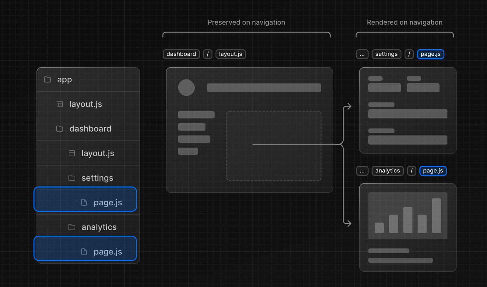

ルート間のナビゲーションには 2 つの方法があります：

- [`<Link>`コンポーネント](#link-コンポーネント)
- [`useRouter` フック](#userouter-hook)

このページでは `<Link>` と `useRouter()` の使い方を説明し、ナビゲーションの仕組みについて深く掘り下げていきます。

## `<Link>` コンポーネント

`<Link>` は HTML の `<a>` 要素を拡張した React コンポーネントで、[プリフェッチ](#プリフェッチ) とルート間のクライアントサイドナビゲーションを提供します。Next.js でルート間をナビゲートする主要な方法です。

`<Link>` を使うには、`next/link` からインポートし、`href` プロパティをコンポーネントに渡します。

```tsx title="app/page.tsx" switcher
import Link from 'next/link'

export default function Page() {
  return <Link href="/dashboard">Dashboard</Link>
}
```

`<Link>`に渡すことができるオプションについて詳しくは[API リファレンス](/docs/app-router/api-reference/components/link)を参照してください。

## Examples

### 動的 Segment へのリンク

[動的セグメント](/docs/app-router/building-your-application/routing/dynamic-routes)にリンクするとき、リンクのリストを生成するために[テンプレートリテラルと補間](https://developer.mozilla.org/en-US/docs/Web/JavaScript/Reference/Template_literals)を使うことができます。例えば、ブログ記事のリストを生成するには、次のようにします。

```jsx title="app/blog/PostList.jsx"
import Link from 'next/link'

export default function PostList({ posts }) {
  return (
    <ul>
      {posts.map((post) => (
        <li key={post.id}>
          <Link href={`/blog/${post.slug}`}>{post.title}</Link>
        </li>
      ))}
    </ul>
  )
}
```

### アクティブなリンクのチェック

リンクがアクティブかどうかを判断するには、[`usePathname()`](/docs/app-router/api-reference/functions/use-pathname)を使うことができます。例えば、アクティブなリンクにクラスを追加するには、現在の `pathname` がリンクの `href` と一致するかどうかをチェックします：

```jsx title="app/ui/Navigation.jsx"
'use client'

import { usePathname } from 'next/navigation'
import { Link } from 'next/link'

export function Navigation({ navLinks }) {
  const pathname = usePathname()

  return (
    <>
      {navLinks.map((link) => {
        const isActive = pathname.startsWith(link.href)

        return (
          <Link
            className={isActive ? 'text-blue' : 'text-black'}
            href={link.href}
            key={link.name}
          >
            {link.name}
          </Link>
        )
      })}
    </>
  )
}
```

### `ID` へのスクロール

Next.js App Router のデフォルトの動作は、新しいルートの先頭までスクロールするか、前後方向のナビゲーションのためにスクロール位置を維持します。

ナビゲーションで特定の `ID` にスクロールしたい場合は、URL に`#`ハッシュリンクを付加するか、`href` prop にハッシュリンクを渡します。これは、`<Link>`が`<a>`要素にレンダリングされるので可能です。

`<Link>`のデフォルトの動作は、[変更されたルートセグメントの先頭にスクロールする](#フォーカスおよびスクロールの管理)です。`href` に `id` が定義されている場合、通常の `<a>` タグと同様に、特定の `id` までスクロールします。

ルート Segment の先頭までスクロールしないようにするには、`scroll={false}` を設定して `href` にハッシュ化された `id` を追加します：

```jsx
<Link href="/dashboard#settings">Settings</Link>

// Output
<a href="/dashboard#settings">Settings</a>
```

### スクロールの復元を無効にする

Next.js App Router のデフォルトの動作は、新しいルートの先頭にスクロールするか、前後方向のナビゲーションのスクロール位置を維持します。この動作を無効にしたい場合は、`<Link>`コンポーネントに `scroll={false}`を渡すか、`router.push()`または `router.replace()`に `scroll: false` を渡します。

```jsx
// next/link
<Link href="/dashboard" scroll={false}>
  Dashboard
</Link>
```

```jsx
// useRouter
import { useRouter } from 'next/navigation'

const router = useRouter()

router.push('/dashboard', { scroll: false })
```

## `useRouter()` Hook

`useRouter` フックを使うと、[クライアントコンポーネント](/docs/app-router/building-your-application/rendering/client-components) 内のルートをプログラムで変更できます。

`useRouter` を使用するには、`next/navigation` からインポートし、Client Component 内でフックを呼び出します：

```jsx title="app/page.jsx"
'use client'

import { useRouter } from 'next/navigation'

export default function Page() {
  const router = useRouter()

  return (
    <button type="button" onClick={() => router.push('/dashboard')}>
      Dashboard
    </button>
  )
}
```

useRouter メソッドの全リストは[API リファレンス](/docs/app-router/api-reference/functions/use-router)を参照してください。

> **推奨:** `useRouter`を使用する特別な要件がない限り、ルート間を移動するには`<Link>`コンポーネントを使用してください。

## ナビゲーションの仕組み

App Router は、ルーティングとナビゲーションのハイブリッド・アプローチを採用しています。サーバー上では、アプリケーションコードは自動的にルートセグメントによってコード分割されます。そしてクライアントでは、Next.js がルートセグメントを[プリフェッチ](#1-プリフェッチ)して[キャッシング](#2-キャッシング)します。つまり、ユーザーが新しいルートに移動しても、ブラウザはページをリロードせず、変更されたルートセグメントだけが再レンダリングされます。

### 1. プリフェッチ

プリフェッチはルートが訪問される前にバックグラウンドでプリロードする方法です。

Next.js でルートがプリフェッチされる方法は 2 つあります：

- `<Link>`コンポーネント: ルートは、ユーザのビューポートに表示されるようになると、自動的にプリフェッチされます。プリフェッチは、ページが最初にロードされたときや、スクロールによって表示されたときに行われます。
- `router.prefetch()`: `useRouter` Hook はプログラムでルートをプリフェッチするために使うことができます。

`<Link>`のプリフェッチ動作は、静的ルートと動的ルートで異なります：

- [静的ルート](/docs/app-router/building-your-application/rendering/server-components#静的レンダリングデフォルト): `prefetch` のデフォルトは `true` です。ルート全体がプリフェッチされ、キャッシュされます。
- [動的ルート](/docs/app-router/building-your-application/rendering/server-components#動的レンダリング): `prefetch` のデフォルトは自動です。最初の `loading.js` ファイルまでの共有レイアウトのみがプリフェッチされ、`30` 秒間キャッシュされます。これは動的なルート全体をフェッチするコストを削減し、ユーザーへの視覚的なフィードバックを改善するために[ロード状態を即座に表示できる](/docs/app-router/building-your-application/routing/loading-ui-and-streaming#インスタントロード状態)ことを意味します。

`prefetch` prop を`false`に設定することで、プリフェッチを無効にすることができます。

詳細は`<Link>` [API リファレンス](/docs/app-router/api-reference/components/link)を参照。

> **Good to know:**
>
> - プリフェッチは開発では有効ではなく、本番でのみ有効です。

### 2. キャッシング

Next.js には、[ルーターキャッシュ](/docs/app-router/building-your-application/data-fetching/fetching-caching-and-revalidating)と呼ばれるインメモリーのクライアントサイドキャッシュがあります。ユーザーがアプリ内を移動すると、[プリフェッチ](#1-プリフェッチ)されたルートセグメントと到達したルートの React Server Component Payload がキャッシュに保存されます。

つまり、ナビゲーションの際、サーバーに新たなリクエストをするのではなく、キャッシュを可能な限り再利用し、リクエストとデータ転送の回数を減らすことでパフォーマンスを向上させます。

ルーターキャッシュの仕組みと設定方法については、[こちら](/docs/app-router/building-your-application/data-fetching/fetching-caching-and-revalidating#データのキャッシュ)をご覧ください。

### 3. 部分レンダリング

部分レンダリングとは、ナビゲーションで変更されたルートセグメントのみがクライアントで再レンダリングされ、共有セグメントは保存されることを意味します。

たとえば、`/dashboard/settings` と `/dashboard/analytics` という 2 つのルート間をナビゲートする場合、`settings` と `analytics` ページがレンダリングされ、共有された `dashboard` のレイアウトは保持されます。



部分レンダリングがなければ、ナビゲーションのたびにページ全体がサーバー上で再レンダリングされることになります。変更されたセグメントのみをレンダリングすることで、転送されるデータ量と実行時間が削減され、パフォーマンスの向上につながります。

### 4. ソフト・ナビゲーション

デフォルトでは、ブラウザはページ間でハードナビゲーションを実行します。これは、ブラウザがページをリロードし、アプリの `useState` フックなどの React の状態と、ユーザーのスクロール位置やフォーカスされた要素などのブラウザの状態をリセットすることを意味します。しかし Next.js では、アプリルーターはソフトナビゲーションを使用します。つまり、React とブラウザの状態を保持したまま、React は変更されたセグメントだけをレンダリングし、ページ全体をリロードすることはありません。

### 5. バック/フォワード・ナビゲーション

デフォルトでは、Next.js は前後方向のナビゲーションのスクロール位置を維持し、[ルーターキャッシュ](/docs/app-router/building-your-application/data-fetching/fetching-caching-and-revalidating#データのキャッシュ)のルートセグメントを再利用します。
