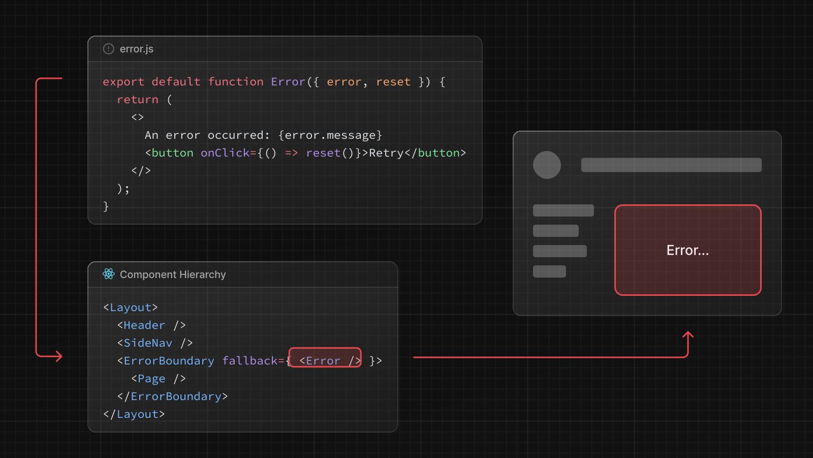
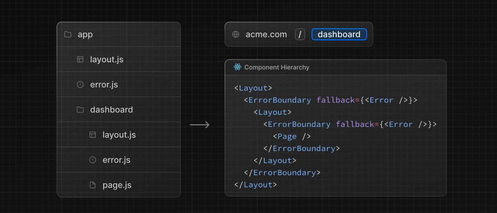

`error.js`ファイル規約によって、[入れ子になったルート](/docs/app-router/building-your-application/routing#ネストされたルート)の実行時エラーを優雅に処理できます。

- ルート Segment とそのネストした子ルートを [React Error Boundary](https://ja.react.dev/reference/react/Component#catching-rendering-errors-with-an-error-boundary) で自動的にラップします。
- ファイルシステム階層を使用して粒度を調整し、特定の Segment に合わせたエラー UI を作成します。
- アプリの残りの機能を維持したまま、影響を受ける Segment にエラーを隔離する。
- ページ全体をリロードすることなくエラーからの回復を試みる機能を追加する。

ルート Segment 内に `error.js` ファイルを追加し、React コンポーネントをエクスポートすることで、エラー UI を作成します。


```tsx title="app/dashboard/error.tsx"
'use client' // Error components must be Client Components

import { useEffect } from 'react'

export default function Error({
  error,
  reset,
}: {
  error: Error
  reset: () => void
}) {
  useEffect(() => {
    // Log the error to an error reporting service
    console.error(error)
  }, [error])

  return (
    <div>
      <h2>Something went wrong!</h2>
      <button
        onClick={
          // Attempt to recover by trying to re-render the segment
          () => reset()
        }
      >
        Try again
      </button>
    </div>
  )
}
```

### `error.js`の仕組み



- `error.js` は自動的に [React Error Boundary](https://ja.react.dev/reference/react/Component#catching-rendering-errors-with-an-error-boundary) を作成し、ネストした子 Segment または `page.js` コンポーネントを **ラッピング** します。
- `error.js`ファイルからエクスポートされた React コンポーネントは、**fallback**コンポーネントとして使用されます。
- エラー境界内でエラーがスローされた場合、エラーは **コンテインメント** され、フォールバックコンポーネントは **レンダリング** されます。
- フォールバックエラーコンポーネントがアクティブな場合、エラー境界より**上の**レイアウトは**その状態を維持**し、**インタラクティブな状態を維持**し、エラーコンポーネントはエラーから回復するための機能を表示できます。

### エラーからの回復

エラーの原因は一時的な場合もあります。このような場合、再試行するだけで問題が解決することもあります。

エラーコンポーネントは `reset()` 関数を使用して、エラーからの回復を試みるようユーザーに促すことができます。実行されると、この関数はエラー境界の内容の再描画を試みます。成功した場合、フォールバックエラーコンポーネントは再レンダリングの結果で置き換えられます。

```tsx title="app/dashboard/error.tsx"
'use client'

export default function Error({
  error,
  reset,
}: {
  error: Error
  reset: () => void
}) {
  return (
    <div>
      <h2>Something went wrong!</h2>
      <button onClick={() => reset()}>Try again</button>
    </div>
  )
}
```

### ネストされたルート

[特別なファイル](/docs/app-router/building-your-application/routing/#ファイル規約)を使って作成された React コンポーネントは、[特定の入れ子階層](/docs/app-router/building-your-application/routing#コンポーネントの階層)でレンダリングされます。

例えば、`layout.js`ファイルと`error.js`ファイルを含む 2 つの Segment を持つネストされたルートは、次のような*simplified*コンポーネント階層でレンダリングされます：



ネストされたコンポーネント階層は、ネストされたルート全体の `error.js` ファイルの動作に影響を与えます：

- エラーはもっとも近い親のエラー境界にバブルアップします。つまり、`error.js` ファイルはネストしたすべての子 Segment のエラーを処理します。ルートのネストされたフォルダ内の異なるレベルに `error.js` ファイルを配置することで、より細かいエラー UI を実現できます。
- エラー境界はそのレイアウトコンポーネントの **内部** にネストされているので、`error.js` 境界は **同じ** Segment の `layout.js` コンポーネントで発生したエラーを処理しません。

### レイアウトのエラー処理

`error.js` の境界は、同じ Segment の `layout.js` や `template.js` コンポーネントで発生したエラーをキャッチしません。この[意図的な階層構造](#ネストされたルート)は、エラーが発生したときに、兄弟ルート間で共有される重要な UI（ナビゲーションなど）を可視化し、機能的に保ちます。

特定のレイアウトやテンプレート内のエラーを処理するには、`error.js`ファイルをレイアウトの親 Segment に置きます。

ルートレイアウトまたはテンプレート内のエラーを処理するには、`error.js`のバリエーションである`global-error.js`を使用します。

### ルートレイアウトでのエラー処理

ルートの `app/error.js` 境界は、ルートの `app/layout.js` または `app/template.js` コンポーネントで発生したエラーをキャッチしません。

これらのルートコンポーネントのエラーを処理するには、ルートディレクトリ `app` にある `app/global-error.js` という `error.js` のバリエーションを使用してください。

ルートの `error.js` とは異なり、`global-error.js` のエラー境界はアプリケーション全体を包み込みます。このため、`global-error.js` は独自の `<html>` タグと `<body>` タグを定義しなければならないことに注意する必要があります。

`global-error.js`はもっとも粒度の小さいエラー UI であり、アプリケーション全体のエラー処理を行う "catch-all "と考えることができます。ルートコンポーネントは一般的にあまり動的ではなく、他の `error.js` 境界がほとんどのエラーをキャッチするため、頻繁にトリガーされることはないでしょう。

`global-error.js`が定義されている場合でも、フォールバックコンポーネントがルートレイアウト内でレンダリングされるルート`error.js`を定義することを推奨します。

```tsx title="app/global-error.tsx"
'use client'

export default function GlobalError({
  error,
  reset,
}: {
  error: Error
  reset: () => void
}) {
  return (
    <html>
      <body>
        <h2>Something went wrong!</h2>
        <button onClick={() => reset()}>Try again</button>
      </body>
    </html>
  )
}
```

### サーバーエラーの処理

<!-- textlint-disable -->

Server Component の内部でエラーがスローされると、Next.js は`Error`オブジェクト（本番環境では機密エラー情報は取り除かれる）を`error` prop として直近の`error.js`ファイルに転送します。

<!-- textlint-enable -->

#### 機密性の高いエラー情報の保護

本番稼動中、クライアントに転送される`Error`オブジェクトには、一般的な`message`と`digest`プロパティのみが含まれます。

これは、エラーに含まれる可能性のある機密情報がクライアントに漏れるのを防ぐためのセキュリティ上の予防措置です。

`message`プロパティにはエラーに関する一般的なメッセージが含まれ、`digest`プロパティにはサーバー側のエラーに対応する自動的に生成されたエラーのハッシュが含まれます。

開発中、クライアントに転送される`Error`オブジェクトはシリアライズされ、デバッグしやすいように元のエラーの`message`が含まれます。
