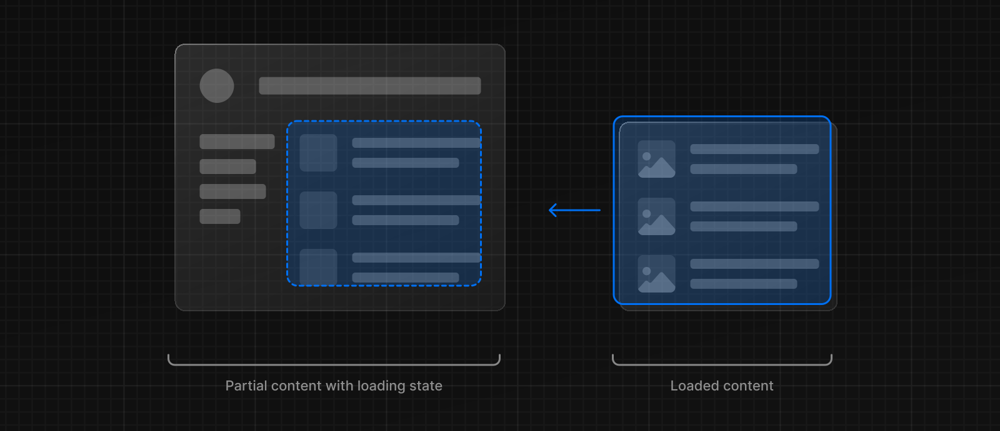
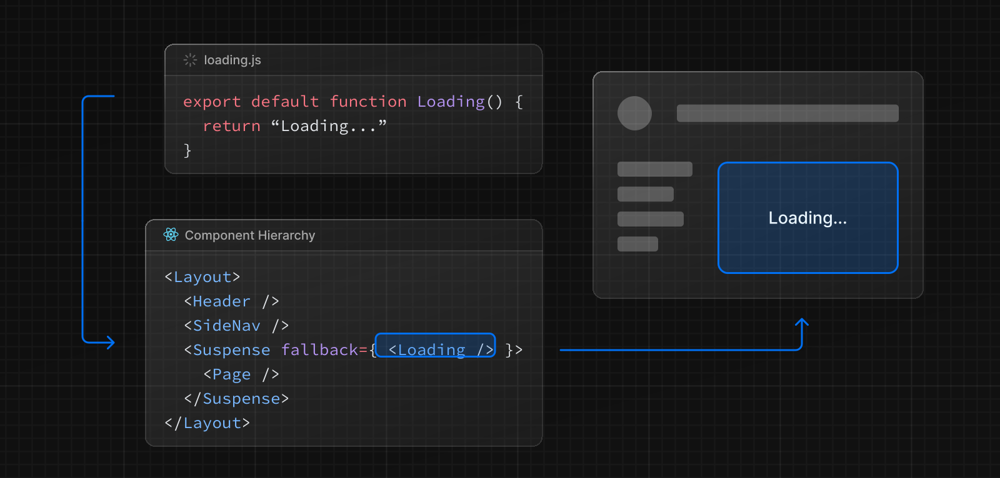
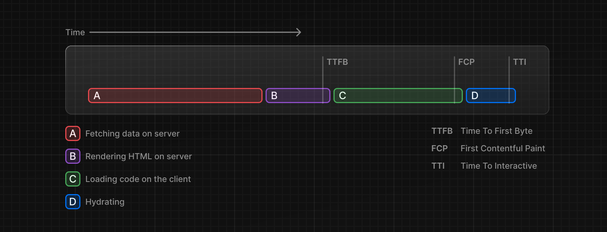
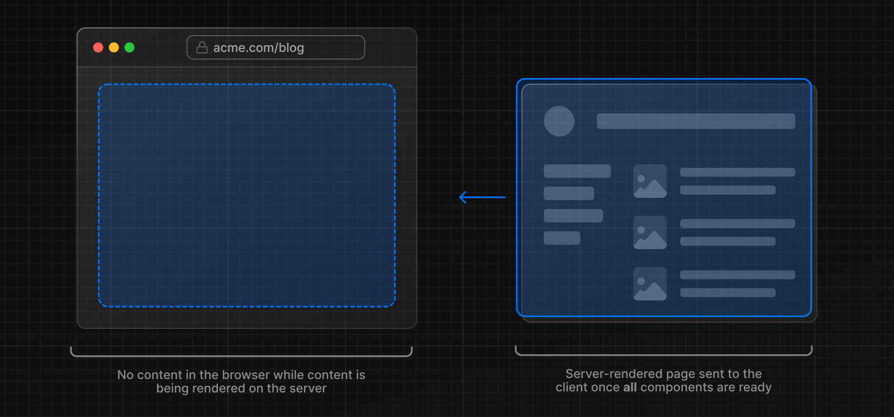
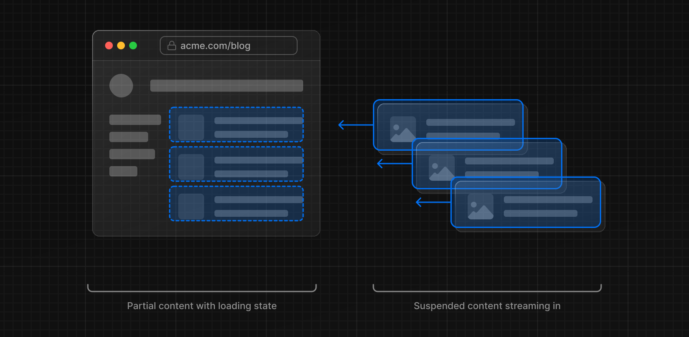
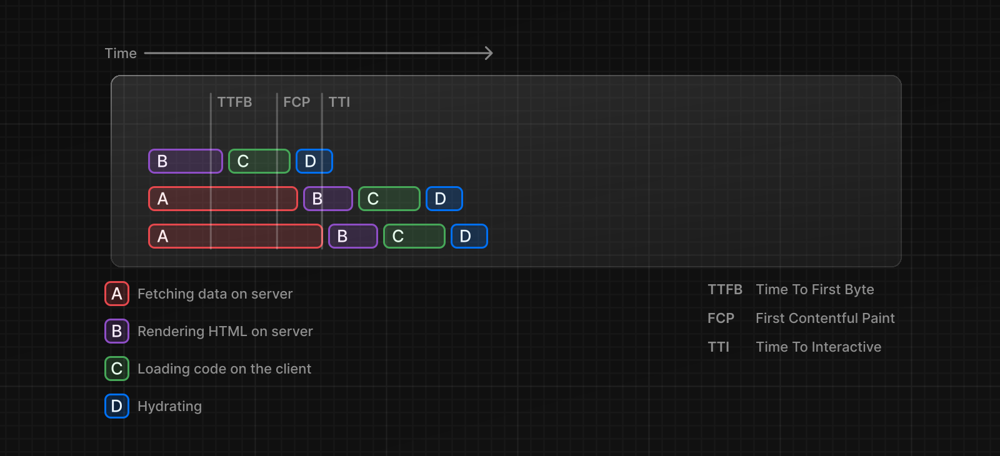

特殊ファイル `loading.js` は、[React Suspense](https://ja.react.dev/reference/react/Suspense) を使って意味のあるローディング UI を作成するのに役立ちます。この規約を使えば、ルート Segment のコンテンツがロードされる間、サーバーから[インスタントロード状態](#インスタントロード状態)を表示できます。



## インスタントロード状態

インスタントローディングステートは、ナビゲーション時に即座に表示されるフォールバック UI です。スケルトンやスピナーのようなローディングインジケータや、カバー写真、タイトルなど、小さいけれども将来の画面の意味のある部分を事前にレンダリングできます。これにより、ユーザーはアプリが応答していることを理解しやすくなり、より良いユーザー体験を提供できます。

フォルダ内に `loading.js` ファイルを追加して、ローディング状態を作成します。


```tsx filename="app/dashboard/loading.tsx" switcher
export default function Loading() {
  // You can add any UI inside Loading, including a Skeleton.
  return <LoadingSkeleton />
}
```

同じフォルダ内にある `loading.js` は `layout.js` の中にネストされる。このとき、`page.js`ファイルとそれ以下の子ファイルは自動的に`<Suspense>`で囲まれる。



> **Good to know:**
>
> - [server-centric routing](/docs/app-router/building-your-application/routing/linking-and-navigating#ナビゲーションの仕組み)であっても、ナビゲーションは即時です。
> - ナビゲーションは中断可能です。つまり、ルートを変更しても、別のルートに移動する前にルートのコンテンツが完全にロードされるまで待つ必要はありません。
> - 新しいルートセグメントがロードされる間、共有レイアウトはインタラクティブなままです。

> **推奨:** Next.js はこの機能を最適化するので、ルートセグメント（レイアウトとページ）には`loading.js`規約を使用してください。

## サスペンスによるストリーミング

`loading.js`に加えて、独自の UI コンポーネント用に手動でサスペンスバウンダリを作成することもできます。App Router は[Node.js および Edge ランタイム](/docs/app-router/building-your-application/rendering/edge-and-nodejs-runtimes)の両方で[Susppense](https://ja.react.dev/reference/react/Suspense)を使ったストリーミングをサポートしています。

### ストリーミングとは？

React と Next.js でストリーミングがどのように機能するかを学ぶには、**サーバーサイド・レンダリング（SSR）**とその限界を理解することが役立ちます。

SSR では、ユーザーがページを見て対話できるようになるまでに、一連のステップを完了する必要があります。

1. まず、あるページのすべてのデータがサーバーに取り込まれます。
2. サーバーがページの HTML をレンダリングする。
3. ページの HTML、CSS、JavaScript がクライアントに送信される。
4. 生成された HTML と CSS を使って、非インタラクティブなユーザーインターフェイスが表示される。
5. 最後に、React [hydrates](https://ja.react.dev/reference/react-dom/client/hydrateRoot#hydrating-server-rendered-html) がユーザーインターフェースをインタラクティブにする。



つまり、サーバーがページの HTML をレンダリングできるのは、すべてのデータがフェッチされてからということになる。またクライアント上では、React は、ページ内のすべてのコンポーネントのコードがダウンロードされた後にのみ、UI をハイドレートできます。
React と Next.js による SSR は、非インタラクティブなページをできるだけ早くユーザーに表示することで、知覚される読み込みパフォーマンスを向上させるのに役立ちます。



しかし、ページをユーザーに表示する前に、サーバー上のすべてのデータ取得を完了させる必要があるため、やはり遅くなることがあります。

**ストリーミング**では、ページの HTML を小さなチャンクに分割し、それらのチャンクをサーバーからクライアントに徐々に送信できます。



これにより、UI がレンダリングされる前にすべてのデータがロードされるのを待つことなく、ページの一部がより早く表示されるようになる。

ストリーミングは React のコンポーネントモデルと相性が良い。優先順位の高いコンポーネント（製品情報など）やデータに依存しないコンポーネントは、最初に送信でき（レイアウトなど）、React は早期にハイドレーションを開始できる。優先順位の低いコンポーネント（レビューや関連商品など）は、データが取得された後、同じサーバーリクエストで送信できます。



ストリーミングは、[Time To First Byte (TTFB)](https://web.dev/ttfb/)や[First Contentful Paint (FCP)](https://web.dev/first-contentful-paint/)を削減できるため、長いデータリクエストがページのレンダリングをブロックするのを防ぎたい場合に特に有益です。また特に低速なデバイスでは、[Time to Interactive (TTI)](https://developer.chrome.com/en/docs/lighthouse/performance/interactive/) の改善にも役立ちます。

### Example

`<Suspense>`は、非同期アクション（例：データ取得）を実行するコンポーネントをラップし、実行中はフォールバック UI（例：スケルトン、スピナー）を表示し、アクションが完了したらコンポーネントを入れ替えます。

```tsx filename="app/dashboard/page.tsx" switcher
import { Suspense } from 'react'
import { PostFeed, Weather } from './Components'

export default function Posts() {
  return (
    <section>
      <Suspense fallback={<p>Loading feed...</p>}>
        <PostFeed />
      </Suspense>
      <Suspense fallback={<p>Loading weather...</p>}>
        <Weather />
      </Suspense>
    </section>
  )
}
```

サスペンスを使うことで、次のような利点がある：

1. **ストリーミングサーバーレンダリング** - サーバーからクライアントへ HTML をプログレッシブにレンダリングします。
2. **Selective Hydration** - React は、ユーザーのインタラクションに基づいて、どのコンポーネントを最初にインタラクティブにするかを優先します。

サスペンスの例や使用例については、[React Documentation](https://ja.react.dev/reference/react/Suspense)を参照してください。

### SEO

- Next.js はクライアントに UI をストリーミングする前に、[`generateMetadata`](/docs/app-router/api-reference/functions/generate-metadata)内のデータ取得が完了するまで待ちます。これにより、ストリームされたレスポンスの最初の部分が `<head>` タグを含むことが保証されます。
- ストリーミングはサーバーレンダリングなので、SEO には影響しません。Google の[Mobile Friendly Test](https://search.google.com/test/mobile-friendly)ツールを使って、Google のウェブクローラーにあなたのページがどのように表示されるかを確認し、シリアライズされた HTML([source](https://web.dev/rendering-on-the-web/#seo-considerations))を見ることができます。
