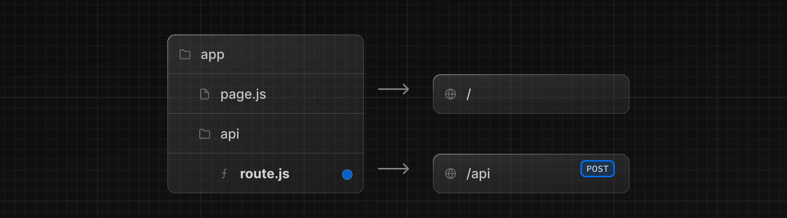

Route Handlers を使うと、Web [Request](https://developer.mozilla.org/en-US/docs/Web/API/Request) と [Response](https://developer.mozilla.org/en-US/docs/Web/API/Response) API を使って、指定したルートのカスタムリクエストハンドラを作成できます。



> **Good to know:** ルートハンドラは `app` ディレクトリ内でのみ利用可能です。これらは `pages` ディレクトリ内の [API Routes](https://nextjs.org/docs/pages/building-your-application/routing/api-routes) に相当します。つまり、API Routes と Route Handlers を一緒に使う必要は**ありません**。

## 規約

ルートハンドラは`app`ディレクトリ内の[`route.js|ts`ファイル](/docs/app-router/api-reference/file-conventions/route)で定義されます。

```ts filename="app/api/route.ts" switcher
export async function GET(request: Request) {}
```

ルートハンドラは `page.js` や `layout.js` と同じように `app` ディレクトリの中に入れ子にできます。しかし、`page.js` と同じルート Segment レベルに `route.js` ファイルを置くことは**できません。**

### サポートされる HTTP メソッド

以下の[HTTP メソッド](https://developer.mozilla.org/en-US/docs/Web/HTTP/Methods)がサポートされている： `GET`、`POST`、`PUT`、`PATCH`、`DELETE`、`HEAD` および `OPTIONS` です。サポートされていないメソッドが呼び出された場合、Next.js は `405 Method Not Allowed` 応答を返します。

### 拡張 `NextRequest` と `NextResponse` API

ネイティブの[Request](https://developer.mozilla.org/en-US/docs/Web/API/Request)と[Response](https://developer.mozilla.org/en-US/docs/Web/API/Response)をサポートしています。Next.js はこれらを次のように拡張します。
[`NextRequest`](/docs/app-router/api-reference/functions/next-request)と[`NextResponse`](/docs/app-router/api-reference/functions/next-response)で拡張し、高度なユースケースのための便利なヘルパーを提供します。

## Behavior

### Static Route Handlers

Route Handlers は `Response` オブジェクトで `GET` メソッドを使うとき、デフォルトでは [静的に評価されます](/docs/app-router/building-your-application/data-fetching#static-and-dynamic-data-fetching)。

```ts filename="app/items/route.ts" switcher
import { NextResponse } from 'next/server'

export async function GET() {
  const res = await fetch('https://data.mongodb-api.com/...', {
    headers: {
      'Content-Type': 'application/json',
      'API-Key': process.env.DATA_API_KEY,
    },
  })
  const data = await res.json()

  return NextResponse.json({ data })
}
```

> **TypeScript Warning:** `NextResponse.json()`は有効ですが、TypeScript のネイティブな型は現在エラーを表示します。

### Dynamic Route Handlers

ルートハンドラは以下の場合に動的に評価されます：

- `Request` オブジェクトを `GET` メソッドで使用する。
- その他の HTTP メソッドを使用する。
- `cookies` や `headers` などの [Dynamic Functions](#dynamic-functions) を使用する。
- [セグメント設定オプション](#segment-config-options) で手動で動的モードを指定する。

例えば

```ts filename="app/products/api/route.ts" switcher
import { NextResponse } from 'next/server'

export async function GET(request: Request) {
  const { searchParams } = new URL(request.url)
  const id = searchParams.get('id')
  const res = await fetch(`https://data.mongodb-api.com/product/${id}`, {
    headers: {
      'Content-Type': 'application/json',
      'API-Key': process.env.DATA_API_KEY,
    },
  })
  const product = await res.json()

  return NextResponse.json({ product })
}
```

同様に、`POST`メソッドは Route Handler を動的に評価します。

```ts filename="app/items/route.ts" switcher
import { NextResponse } from 'next/server'

export async function POST() {
  const res = await fetch('https://data.mongodb-api.com/...', {
    method: 'POST',
    headers: {
      'Content-Type': 'application/json',
      'API-Key': process.env.DATA_API_KEY,
    },
    body: JSON.stringify({ time: new Date().toISOString() }),
  })

  const data = await res.json()

  return NextResponse.json(data)
}
```

> **Note:** 以前は、API ルートはフォーム送信を処理するようなユースケースに使用できた。ルートハンドラはこのようなユースケースの解決策にはならないでしょう。準備が整い次第、[mutation](/docs/app-router/building-your-application/data-fetching/forms-and-mutations)の使用を推奨します。

### Route 解決

`ルート`は最下層のルーティングプリミティブと考えることができる。

- それらは `page` のようなレイアウトやクライアントサイドのナビゲーションには **参加しません**。
- `page.js` と同じルートに `route.js` ファイルを置くことは**できません。**

| Page                 | Route              | Result                       |
| -------------------- | ------------------ | ---------------------------- |
| `app/page.js`        | `app/route.js`     | <Cross size={18} /> Conflict |
| `app/page.js`        | `app/api/route.js` | <Check size={18} /> Valid    |
| `app/[user]/page.js` | `app/api/route.js` | <Check size={18} /> Valid    |

各 `route.js` または `page.js` ファイルは、そのルートのすべての HTTP verbs を引き継ぎます。

```tsx filename="app/page.js"
export default function Page() {
  return <h1>Hello, Next.js!</h1>
}

// ❌ Conflict
// `app/route.js`
export async function POST(request) {}
```

## Examples

次の例では、Route ハンドラを他の Next.js API や機能と組み合わせる方法を示します。

### 静的データの再検証

[静的データの再検証](/docs/app-router/building-your-application/data-fetching/fetching-caching-and-revalidating)フェッチは、[`next.revalidate`](/docs/app-router/building-your-application/data-fetching/fetching-caching-and-revalidating#データの再検証)オプションを使って行うことができます：

```ts filename="app/items/route.ts" switcher
import { NextResponse } from 'next/server'

export async function GET() {
  const res = await fetch('https://data.mongodb-api.com/...', {
    next: { revalidate: 60 }, // Revalidate every 60 seconds
  })
  const data = await res.json()

  return NextResponse.json(data)
}
```

あるいは、[`revalidate` セグメント設定オプション](/docs/app-router/api-reference/file-conventions/route-segment-config#revalidate) を使うこともできます。

```ts
export const revalidate = 60
```

### Dynamic Functions

ルートハンドラは、[`cookies`](/docs/app-router/api-reference/functions/cookies)や[`headers`](/docs/app-router/api-reference/functions/headers)のような Next.js の動的関数と一緒に使うことができます。

#### Cookies

`next/headers`から[`cookies`](/docs/app-router/api-reference/functions/cookies)を使ってクッキーを読み込むことができます。このサーバー関数は Route Handler の中で直接呼び出すことも、他の関数の中にネストして呼び出すこともできます。

この `cookies` インスタンスは読み取り専用です。クッキーを設定するには、[`Set-Cookie`](https://developer.mozilla.org/en-US/docs/Web/HTTP/Headers/Set-Cookie) ヘッダを使用して新しい `Response` を返す必要があります。

```ts filename="app/api/route.ts" switcher
import { cookies } from 'next/headers'

export async function GET(request: Request) {
  const cookieStore = cookies()
  const token = cookieStore.get('token')

  return new Response('Hello, Next.js!', {
    status: 200,
    headers: { 'Set-Cookie': `token=${token}` },
  })
}
```

あるいは、クッキーを読むために、基礎となる Web API の上で抽象化を使うこともできます（[`NextRequest`](/docs/app-router/api-reference/functions/next-request)）：

```ts filename="app/api/route.ts" switcher
import { type NextRequest } from 'next/server'

export async function GET(request: NextRequest) {
  const token = request.cookies.get('token')
}
```

#### Headers

`next/headers`から[`headers`](/docs/app-router/api-reference/functions/headers)を使ってヘッダーを読み込むことができます。このサーバー関数は Route Handler の中で直接呼び出すことも、他の関数の中にネストして呼び出すこともできます。

この `headers` インスタンスは読み取り専用です。ヘッダを設定するには、新しい `headers` を持つ新しい `Response` を返す必要があります。

```ts filename="app/api/route.ts" switcher
import { headers } from 'next/headers'

export async function GET(request: Request) {
  const headersList = headers()
  const referer = headersList.get('referer')

  return new Response('Hello, Next.js!', {
    status: 200,
    headers: { referer: referer },
  })
}
```

あるいは、ヘッダーを読み込むために、基礎となる Web API の上で抽象化を使用することもできます（[`NextRequest`](/docs/app-router/api-reference/functions/next-request)）

```ts filename="app/api/route.ts" switcher
import { type NextRequest } from 'next/server'

export async function GET(request: NextRequest) {
  const requestHeaders = new Headers(request.headers)
}
```

### Redirects

```ts filename="app/api/route.ts" switcher
import { redirect } from 'next/navigation'

export async function GET(request: Request) {
  redirect('https://nextjs.org/')
}
```

### 動的ルート Segment

> 先に進む前に、[Defining Routes](/docs/app-router/building-your-application/routing/defining-routes) ページを読むことをお勧めします。

ルートハンドラは[Dynamic Segments](/docs/app-router/building-your-application/routing/dynamic-routes)を使って、動的なデータからリクエストハンドラを作成できます。

```ts filename="app/items/[slug]/route.ts" switcher
export async function GET(
  request: Request,
  { params }: { params: { slug: string } }
) {
  const slug = params.slug // 'a', 'b', or 'c'
}
```

| Route                       | Example URL | `params`        |
| --------------------------- | ----------- | --------------- |
| `app/items/[slug]/route.js` | `/items/a`  | `{ slug: 'a' }` |
| `app/items/[slug]/route.js` | `/items/b`  | `{ slug: 'b' }` |
| `app/items/[slug]/route.js` | `/items/c`  | `{ slug: 'c' }` |

### Streaming

```ts filename="app/api/route.ts" switcher
// https://developer.mozilla.org/en-US/docs/Web/API/ReadableStream#convert_async_iterator_to_stream
function iteratorToStream(iterator: any) {
  return new ReadableStream({
    async pull(controller) {
      const { value, done } = await iterator.next()

      if (done) {
        controller.close()
      } else {
        controller.enqueue(value)
      }
    },
  })
}

function sleep(time: number) {
  return new Promise((resolve) => {
    setTimeout(resolve, time)
  })
}

const encoder = new TextEncoder()

async function* makeIterator() {
  yield encoder.encode('<p>One</p>')
  await sleep(200)
  yield encoder.encode('<p>Two</p>')
  await sleep(200)
  yield encoder.encode('<p>Three</p>')
}

export async function GET() {
  const iterator = makeIterator()
  const stream = iteratorToStream(iterator)

  return new Response(stream)
}
```

### Request Body

標準の Web API メソッドを使って `Request` 本体を読むことができます。

```ts filename="app/items/route.ts" switcher
import { NextResponse } from 'next/server'

export async function POST(request: Request) {
  const res = await request.json()
  return NextResponse.json({ res })
}
```

### CORS

標準的な Web API メソッドを使用して、`Response` に CORS ヘッダを設定できる。

```ts filename="app/api/route.ts" switcher
export async function GET(request: Request) {
  return new Response('Hello, Next.js!', {
    status: 200,
    headers: {
      'Access-Control-Allow-Origin': '*',
      'Access-Control-Allow-Methods': 'GET, POST, PUT, DELETE, OPTIONS',
      'Access-Control-Allow-Headers': 'Content-Type, Authorization',
    },
  })
}
```

### Edge and Node.js Runtimes

Route ハンドラは、ストリーミングのサポートを含め、Edge と Node.js の両方のランタイムをシームレスにサポートする同型の Web API を持っています。Route ハンドラは Pages や Layouts と同じ[route segment configuration](/docs/app-router/api-reference/file-conventions/route-segment-config)を使うので、汎用の[静的に再生成される](/docs/app-router/building-your-application/data-fetching/fetching-caching-and-revalidating#データの再検証)Route ハンドラのような待望の機能をサポートします。

ランタイムを指定するには、`runtime`Segment コンフィグオプションを使います。

```ts
export const runtime = 'edge' // 'nodejs' is the default
```

### Non-UI Responses

非 UI コンテンツを返すために Route ハンドラを使うことができます。[`sitemap.xml`](/docs/app-router/api-reference/file-conventions/metadata/sitemap#サイトマップを生成する), [`robots.txt`](/docs/app-router/api-reference/file-conventions/metadata/robots#robotsファイルを生成する), [`app icons`](/docs/app-router/api-reference/file-conventions/metadata/app-icons#アイコンを生成するコードを使用するjststsx), と [`open graph images`](/docs/app-router/api-reference/file-conventions/metadata/opengraph-image) はすべてビルトインサポートです。

```ts filename="app/rss.xml/route.ts" switcher
export async function GET() {
  return new Response(`<?xml version="1.0" encoding="UTF-8" ?>
<rss version="2.0">

<channel>
  <title>Next.js Documentation</title>
  <link>https://nextjs.org/docs</link>
  <description>The React Framework for the Web</description>
</channel>

</rss>`)
}
```

### Segment Config Options

ルートハンドラは、ページやレイアウトと同じ[ルートセグメントの設定](/docs/app-router/api-reference/file-conventions/route-segment-config)を使用します。

```ts filename="app/items/route.ts" switcher
export const dynamic = 'auto'
export const dynamicParams = true
export const revalidate = false
export const fetchCache = 'auto'
export const runtime = 'nodejs'
export const preferredRegion = 'auto'
```

詳細は[API リファレンス](/docs/app-router/api-reference/file-conventions/route-segment-config)を参照してください。
