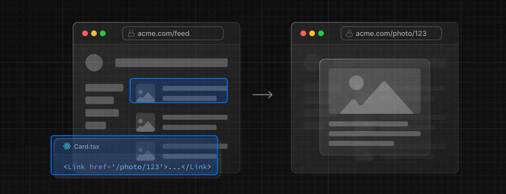
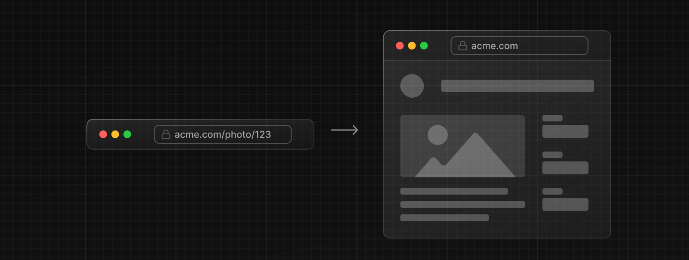
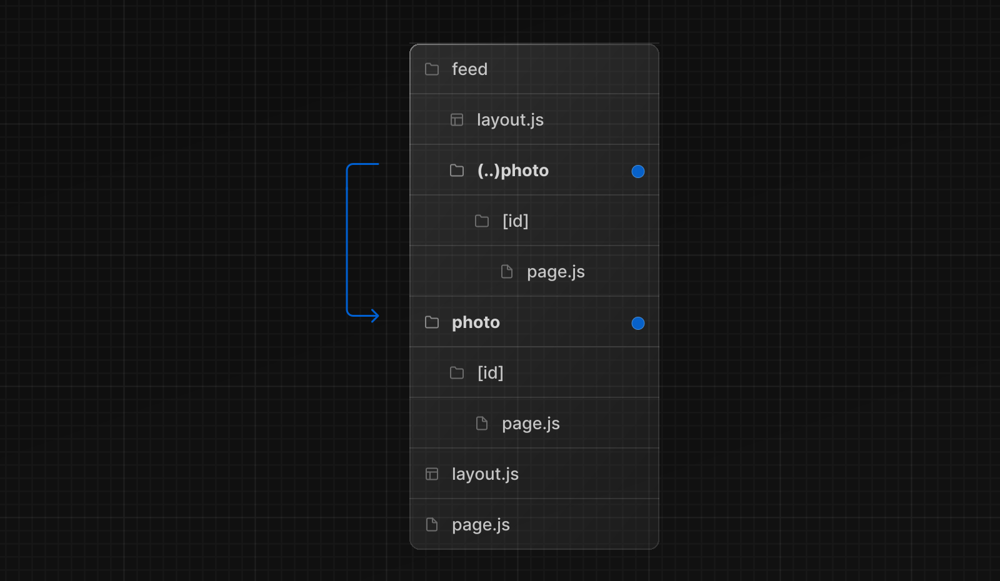
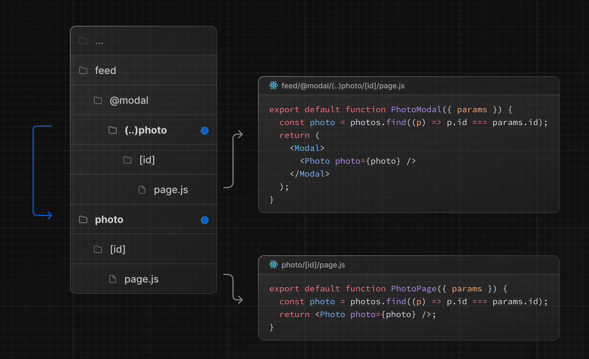

Intercepting Routes は現在のページのコンテキストを維持したまま、現在のレイアウト内でルートをロードできます。このルーティングパラダイムは異なるルートを表示するために特定のルートを「インターセプト」したいときに便利です。

たとえば、フィードの中から写真をクリックすると、フィードの上にモーダルが表示され、写真が表示されるはずです。この場合、Next.js は `/feed` ルートをインターセプトして、この URL を「マスク」し、代わりに `/photo/123` を表示します。

ただし、共有可能な URL をクリックしたり、ページを更新したりして直接写真に移動した場合は、モーダルの代わりに写真ページ全体がレンダリングされます。ルートのインターセプトは発生しません。

## 規約

インターセプトルートは `(..)` という規則で定義できます。これは相対パスの規則 `../` に似ていますが、Segment に対するものです。

下記を使うことができます。

- `(.)` は **同じレベル** の Segment とマッチします。
- `(..)`は **1** つうえのレベルの Segment とマッチします。
- `(..)(..)` は **2** つうえのレベルの Segment にマッチします。
- `(...)` は **ルート** `app` ディレクトリの Segment にマッチします。

例えば、`(..)photo` ディレクトリを作成することで、`feed` Segment の中から `photo` Segment をインターセプトできます。

> `(..)`の規約は、ファイルシステムではなく、\_ルートセグメントに基づいていることに注意してください。

## Examples

### モーダル

Intercepting Routes は[Parallel Routes](/docs/app-router/building-your-application/routing/parallel-routes)と一緒に使うことで、モーダルを作成できます。

モーダルを作成するためにこのパターンを使うことで、モーダルで作業するときによくあるいくつかの課題を克服できます。

- モーダルコンテンツを**URL で共有可能**にする。
- ページがリフレッシュされたときに、モーダルを閉じる代わりに、**コンテキストを保持します。**
- 後方ナビゲーションで、前のルートに移動せずに**モーダルを閉じる。**
- **前方ナビゲーションでモーダルを再開する。**

> 上の例では、`@modal`は*slot*であり、*segment*ではないので、`photo` セグメントへのパスは `(..)` matcher を使うことができます。つまり、`photo` のルートは 2 つうえの*file-system* レベルにあるにもかかわらず、1 つうえの*segment* レベルにしかない。

他の例としては、`/login` 専用ページを持ちながら、トップナビゲーションバーでログインモーダルを開いたり、サイドモーダルでショッピングカートを開いたりできます。

Intercepted と Parallel Routes を使用したモーダルの [例を見る](https://github.com/vercel-labs/nextgram)。
