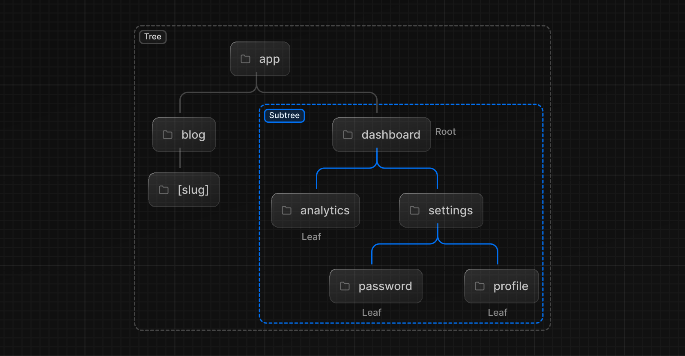
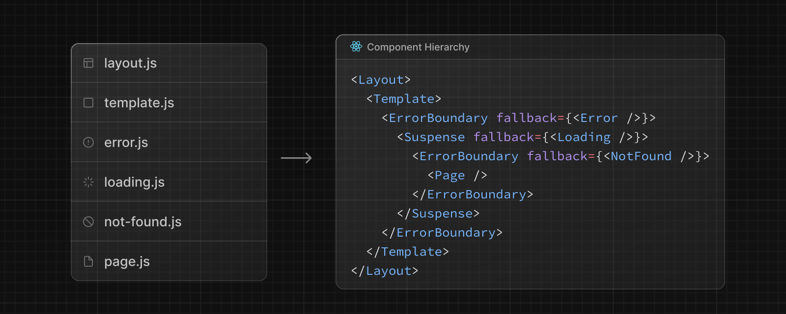
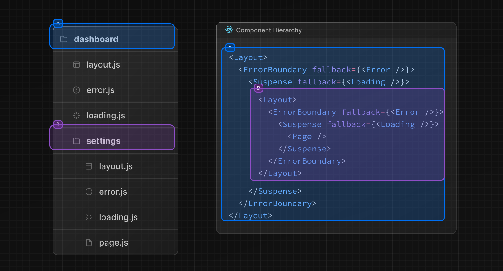
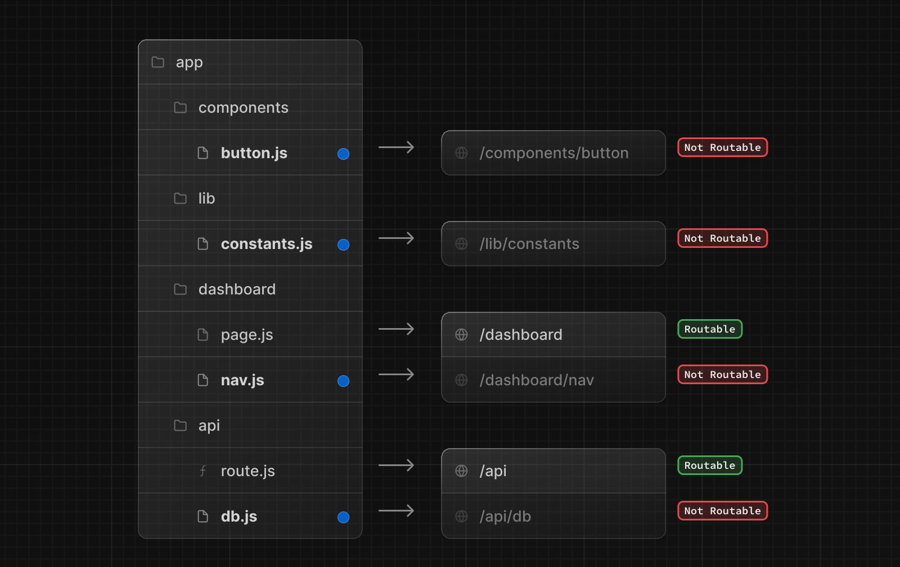

すべてのアプリケーションの骨格はルーティングです。このページでは、Web のルーティングの**基本的な概念**と、Next.js でのルーティングの扱い方を紹介します。

## 用語解説

まず、ドキュメントのいたるところで、これらの用語が使われています。簡単なリファレンスです。

- **Tree:** 階層構造を視覚化するための規約。例えば、親と子のコンポーネントを持つコンポーネントツリー、フォルダ構造など。
<!-- textlint-disable -->
- **Subtree:** Tree の一部で、新しい Root（最初）から始まり、Leaf（最後）で終わる。
- **Root**: Root レイアウトなど、Tree または Subtree の最初のノード。
- **Leaf:** URL パスの最後の Segment など、子ノードを持たない Subtree のノード。
<!-- textlint-enable -->

- **URL Segment:** スラッシュで区切られた URL パスの一部
- **URL Path:** ドメインの後に来る URL の一部（Segment で構成される）

## `App` Router

<!-- textlint-disable -->

バージョン 13 で、Next.js は[React Server Components](/docs/app-router/building-your-application/rendering/server-components)上に構築された新しい**App Router**を導入し、共有レイアウト、ネストされたルーティング、ロード状態、エラー処理などをサポートしました。

<!-- textlint-enable -->

App Router は `app` という名前の新しいディレクトリで動作する。`app` ディレクトリは `pages` ディレクトリと一緒に動作し、インクリメンタルな導入を可能にする。これにより、アプリケーションの一部のルートを新しい動作に移行させ、他のルートを `pages` ディレクトリに残して以前の動作に移行させることができます。アプリケーションが `pages` ディレクトリを使用している場合は、[Pages Router](https://nextjs.org/docs/pages/building-your-application/routing) ドキュメントも参照してください。

> **Good to know:** App Router は Pages Router よりも優先されます。ディレクトリをまたがるルーティングは同じ URL パスに解決されるべきではなく、競合を防ぐためにビルド時にエラーが発生します。

デフォルトでは、`app`内のコンポーネントは[React Server Components](/docs/app-router/building-your-application/rendering/server-components)です。これはパフォーマンスの最適化であり、簡単に採用できます。また[Client Components](/docs/app-router/building-your-application/rendering/client-components) を使用できます。

> **推奨**： Server Components を初めて使う場合は、[Server](/docs/app-router/building-your-application/rendering/server-components) ページをチェックしてください。

## フォルダーとファイルの役割

Next.js はファイルシステムベースの Router を使います。

- **フォルダー**はルートを定義するために使用されます。ルートはネストされたフォルダのシングルパスで、**ルートフォルダ**から、`page.js`ファイルを含む最終的な**Leaf フォルダ**までのファイルシステム階層をたどります。[ルーティングの定義](/docs/app-router/building-your-application/routing/defining-routes)を参照してください。
- **ファイル**は、ルート Segment に対して表示される UI を作成するために使われます。[特殊ファイル](#ファイル規約)を参照してください。

## ルート Segment

ルートの各フォルダは **ルート Segment** を表します。各ルート Segment は**URL パス**の対応する**Segment**にマップされます。

## ネストされたルート

ネストされたルートを作るには、フォルダ同士を入れ子にします。例えば、`dashboard/settings` ルートを追加するには、`app` ディレクトリに 2 つの新しいフォルダを入れ子にします。

`dashboard/settings`ルートは 3 つの Segment で構成されます：

- `/` (ルート Segment)
- `dashboard` (Segment)
- `settings` (LeafSegment)

## ファイル規約

Next.js はネストされたルートで特定の動作をする UI を作るための特殊ファイル群を提供します。

|                                                                                                 |                                                                                                     |
| ----------------------------------------------------------------------------------------------- | --------------------------------------------------------------------------------------------------- |
| [`layout`](/docs/app-router/building-your-application/routing/pages-and-layouts#レイアウト)     | Segment とその子の共有 UI                                                                           |
| [`page`](/docs/app-router/building-your-application/routing/pages-and-layouts#ページ)           | ルートのユニークな UI とルートの一般公開                                                            |
| [`loading`](/docs/app-router/building-your-application/routing/loading-ui-and-streaming)        | Segment とその子の UI をロードする                                                                  |
| [`not-found`](/docs/app-router/api-reference/file-conventions/not-found)                        | Segment とその子の UI が見つからない                                                                |
| [`error`](/docs/app-router/building-your-application/routing/error-handling)                    | Segment とその子のエラー UI                                                                         |
| [`global-error`](/docs/app-router/building-your-application/routing/error-handling)             | グローバルエラー UI                                                                                 |
| [`route`](/docs/app-router/building-your-application/routing/route-handlers)                    | サーバーサイド API エンドポイント                                                                   |
| [`template`](/docs/app-router/building-your-application/routing/pages-and-layouts#テンプレート) | 特殊な再レンダリングされたレイアウト UI                                                             |
| [`default`](/docs/app-router/api-reference/file-conventions/default)                            | [並列ルート](/docs/app-router/building-your-application/routing/parallel-routes)のフォールバック UI |

> **Good to know:** `.js`、`.jsx`、`.tsx`のファイル拡張子は特別なファイルに使用できます。

## コンポーネントの階層

ルート Segment の特殊ファイルで定義された React コンポーネントは、特定の階層でレンダリングされます。

- `layout.js`
- `template.js`
- `error.js` (React error boundary)
- `loading.js` (React suspense boundary)
- `not-found.js` (React error boundary)
- `page.js` またはネストされた `layout.js`

入れ子になったルートでは、Segment のコンポーネントは親 Segment のコンポーネントの**中に**入れ子となります。

## コロケーション

特殊ファイルに加え、独自のファイル（コンポーネント、スタイル、テストなど）を `app` ディレクトリのフォルダ内に配置できます。

これは、フォルダがルートを定義する一方で、`page.js` や `route.js` が返すコンテンツだけが公開アドレスになるからです。

[プロジェクト編成とコロケーション](/docs/app-router/building-your-application/routing/colocation)についてもっと知る。

## 高度なルーティングパターン

App Router には、より高度なルーティングパターンを実装するのに役立つ規約も用意されている。以下のようなものがあります：

- [Parallel Routes](/docs/app-router/building-your-application/routing/parallel-routes)： 独立してナビゲートできる 2 つ以上のページを同じビューに同時に表示できます。独自のサブナビゲーションを持つ分割ビューに使用できます。例：ダッシュボード
- [インターセプトルート](/docs/app-router/building-your-application/routing/intercepting-routes)： ルートをインターセプトし、別のルートのコンテキストで表示できるようにします。現在のページのコンテキストを維持することが重要な場合、これらを使うことができます。例えば、あるタスクを編集しているときにすべてのタスクを表示したり、フィードの写真を拡大したりできます

これらのパターンによって、よりリッチで複雑な UI を構築でき、これまで小規模なチームや個人開発者では実装するのが複雑だった機能を民主化できます。

## 次のステップ

Next.js のルーティングの基本を理解したところで、次のリンクから最初のルートを作成してみましょう。
