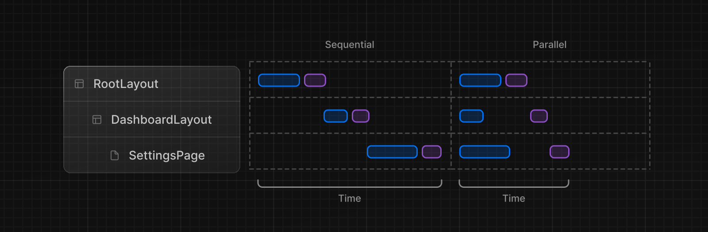

React と Next.js でデータをフェッチするには、いくつかの推奨パターンとベストプラクティスがあります。このページでは、もっとも一般的なパターンとその使い方について説明します。

## サーバー上でのデータフェッチ

可能な限りサーバー上でデータを取得することをお勧めします。これにより、以下のことが可能になります：

- バックエンドのデータ・リソース（データベースなど）に直接アクセスできる
- アクセストークンや API キーなどの機密情報がクライアントに公開されるのを防ぎ、アプリケーションをより安全に保つ
- 同じ環境でデータを取得し、レンダリングします。これにより、クライアントとサーバー間の往復通信と、クライアント上の[メインスレッドでの作業](https://vercel.com/blog/how-react-18-improves-application-performance)の両方が削減されます
- クライアントへの複数の個別リクエストの代わりに、1 回のラウンドトリップで複数のデータを取得します
- クライアントとサーバーの[ウォーターフォール](/docs/app-router/building-your-application/data-fetching/patterns#パラレルなデータフェッチとシーケンシャルなデータフェッチ)を減らす
- リージョンによっては、データ・フェッチはデータ・ソースの近くで行われ、待ち時間を短縮し、パフォーマンスを向上させることもできます
- Server Components、ルートハンドラ、およびサーバーアクションを使用して、サーバー上でデータをフェッチできます

Server Components、[ルートハンドラ](/docs/app-router/building-your-application/routing/route-handlers)、および[Server Actions](/docs/app-router/building-your-application/data-fetching/server-actions-and-mutations)を使用して、サーバー上でデータをフェッチできます。

> **Good to know**：これはレイアウトにも当てはまり、親レイアウトとその子の間でデータを受け渡すことはできません。

## 必要な場所でデータをフェッチする

ツリー内の複数のコンポーネントで同じデータ（現在のユーザーなど）を使用する必要がある場合、グローバルにデータをフェッチしたり、コンポーネント間で prop を転送したりする必要はありません。代わりに、同じデータに対して複数のリクエストを行うことによるパフォーマンスへの影響を心配することなく、データを必要とするコンポーネントで`fetch`または React `cache`を使用できます。

これが可能なのは、fetch リクエストが自動的にメモ化されるからです。リクエストの[メモ化](/docs/app-router/building-your-application/caching#request-memoization)の詳細についてはこちらを参照してください。

## Streaming

Streaming と[Suspense](https://ja.react.dev/reference/react/Suspense)は React の機能で、UI のレンダリングユニットを徐々にレンダリングし、クライアントへインクリメンタルにストリーミングできます。

Server Components と[ネストされたレイアウト](/docs/app-router/building-your-application/routing/pages-and-layouts)を使用すると、特にデータを必要としないページの部分を即座にレンダリングし、データをフェッチしているページの部分については[ロードの状態](/docs/app-router/building-your-application/routing/loading-ui-and-streaming)を表示できます。つまり、ユーザーはページ全体の読み込みを待たずに、ページの操作を開始できます。


Streaming と Suspense について詳しくは、[ロード UI](/docs/app-router/building-your-application/routing/loading-ui-and-streaming)、[ストリーミングとサスペンス](/docs/app-router/building-your-application/routing/loading-ui-and-streaming#サスペンスによるストリーミング)のページを参照してください。

## パラレルなデータフェッチとシーケンシャルなデータフェッチ

React コンポーネント内でデータをフェッチする場合、パラレルとシーケンシャルの 2 つのデータフェッチ・パターンを意識する必要があります。



- **シーケンシャルなデータフェッチ**では、ルート内のリクエストは互いに依存するため、ウォーターフォールが発生します。1 つのフェッチが他のフェッチの結果に依存するため、あるいはリソースを節約するために次のフェッチの前に条件を満たす必要があるため、このパターンが必要な場合もあります。しかし、この動作は意図的でない場合もあり、ロード時間の延長につながります。
- **パラレルなデータフェッチ**では、ルート内のリクエストは積極的に開始され、同時にデータをロードします。これにより、クライアントとサーバーのウォーターフォールが減少し、データのロードにかかる総時間が短縮されます。

### シーケンシャルなデータフェッチ

ネストされたコンポーネントがあり、各コンポーネントがそれ自身のデータをフェッチする場合、それらのデータ要求が異なるのであれば、データフェッチは順次行われます（同じデータに対する要求は自動的に[メモ](/docs/app-router/building-your-application/caching#request-memoization)されるため、これは当てはまりません）。

例えば、`Playlists`コンポーネントは、`Artist`コンポーネントがデータのフェッチを終了した後にのみデータのフェッチを開始します：

```tsx title="app/artist/[username]/page.tsx"
// ...

async function Playlists({ artistID }: { artistID: string }) {
  // Wait for the playlists
  const playlists = await getArtistPlaylists(artistID)

  return (
    <ul>
      {playlists.map((playlist) => (
        <li key={playlist.id}>{playlist.name}</li>
      ))}
    </ul>
  )
}

export default async function Page({
  params: { username },
}: {
  params: { username: string }
}) {
  // Wait for the artist
  const artist = await getArtist(username)

  return (
    <>
      <h1>{artist.name}</h1>
      <Suspense fallback={<div>Loading...</div>}>
        <Playlists artistID={artist.id} />
      </Suspense>
    </>
  )
}
```

<!-- textlint-disable -->

このような場合、[`loading.js`](/docs/app-router/building-your-application/routing/loading-ui-and-streaming)（ルート Segment 用）または React [`<Suspense>`](/docs/app-router/building-your-application/routing/loading-ui-and-streaming#サスペンスによるストリーミング)（ネストされたコンポーネント用）を使用して、React が結果をストリームしている間、即座にロード状態を表示できます。

<!-- textlint-enable -->

これにより、ルート全体がデータフェッチによってブロックされるのを防ぐことができ、ユーザーはブロックされていないページの部分と対話を始められます。

> データ要求をブロックする：
>
> ウォーターフォールを防ぐための別のアプローチとして、アプリケーションのルートでグローバルにデータをフェッチする方法がありますが、これはデータの読み込みが終わるまで、その下のすべてのルートセグメントのレンダリングをブロックします。これは、"all or nothing" データフェッチと言えます。ページやアプリケーションの全データがあるか、何も無いかのどちらかです。
>
> `<Suspense>`境界でラップされているか、`loading.js`が使用されていない限り、`await`を使用したフェッチリクエストは、その下のツリー全体のレンダリングとデータフェッチをブロックします。別の方法として、[並列データフェッチ](#パラレルなデータフェッチ)や[プリロードパターン](#データのプリロード)を使用することもできます。

### パラレルなデータフェッチ

パラレル（並行）にデータを取得するには、データを使用するコンポーネントの外側でリクエストを定義し、コンポーネントの内側から呼び出すことで、積極的にリクエストを開始させます。これは、複数のリクエストを並行して開始することで時間を節約しますが、複数のプロミスが解決されるまで、ユーザーはレンダリング結果を見ることができません。

以下の例では、`getArtist`関数と`getArtistAlbums`関数を`Page`コンポーネントの外部で定義し、コンポーネントの内部で呼び出して、両方のプロミスが解決するのを待っています：

```tsx title="app/artist/[username]/page.tsx"
import Albums from './albums'

async function getArtist(username: string) {
  const res = await fetch(`https://api.example.com/artist/${username}`)
  return res.json()
}

async function getArtistAlbums(username: string) {
  const res = await fetch(`https://api.example.com/artist/${username}/albums`)
  return res.json()
}

export default async function Page({
  params: { username },
}: {
  params: { username: string }
}) {
  // 両リクエストを並行に開始する
  const artistData = getArtist(username)
  const albumsData = getArtistAlbums(username)

  // プロミスが解決するのを待つ
  const [artist, albums] = await Promise.all([artistData, albumsData])

  return (
    <>
      <h1>{artist.name}</h1>
      <Albums list={albums}></Albums>
    </>
  )
}
```

ユーザー・エクスペリエンスを向上させるために、[Suspense 境界](/docs/app-router/building-your-application/routing/loading-ui-and-streaming)を追加してレンダリング作業を中断し、結果の一部をできるだけ早く表示できます。

## データのプリロード

ウォーターフォールを防ぐもうひとつの方法は、プリロード・パターンを使うことです。任意の`preload`関数を作れば、並列データフェッチをさらに最適化できます。この方法を使えば、props としてプロミスを渡す必要はありません。また`preload`関数は API ではなくパターンなので、任意の名前をつけることができます。

```tsx title="components/item.tsx"
import { getItem } from '@/utils/get-item'

export const preload = (id: string) => {
  // voidは与えられた式を評価し、未定義を返す
  // https://developer.mozilla.org/docs/Web/JavaScript/Reference/Operators/void
  void getItem(id)
}
export default async function Item({ id }: { id: string }) {
  const result = await getItem(id)
  // ...
}
```

```tsx title="app/item/[id]/page.tsx"
import Item, { preload, checkIsAvailable } from '@/components/Item'

export default async function Page({
  params: { id },
}: {
  params: { id: string }
}) {
  // アイテムデータのロードを開始する
  preload(id)
  // 他の非同期タスクを実行する
  const isAvailable = await checkIsAvailable()

  return isAvailable ? <Item id={id} /> : null
}
```

## React `cache`、`server-only`とプリロードのパターン

`cache`関数、`preload`パターン、`server-only`パッケージを組み合わせることで、アプリ全体で使用できるデータ取得ユーティリティを作成できます。

```ts title="utils/get-item.ts"
import { cache } from 'react'
import 'server-only'

export const preload = (id: string) => {
  void getItem(id)
}

export const getItem = cache(async (id: string) => {
  // ...
})
```

このアプローチでは、データを積極的にフェッチし、レスポンスをキャッシュし、このデータフェッチが[サーバー上だけで行われる](/docs/app-router/building-your-application/rendering/composition-patterns#サーバー専用のコードをクライアント環境に持ち込まない)ことを保証できます。

`utils/get-item`エクスポートは、アイテムのデータがフェッチされるタイミングを制御するために、Layout、Page、
または他のコンポーネントによって使用されます。

> **Good to know**:
>
> - サーバーのデータ取得関数がクライアントで使用されることがないように、[`server-only`パッケージ](/docs/app-router/building-your-application/rendering/composition-patterns#サーバー専用のコードをクライアント環境に持ち込まない)を使用することをお勧めします。
