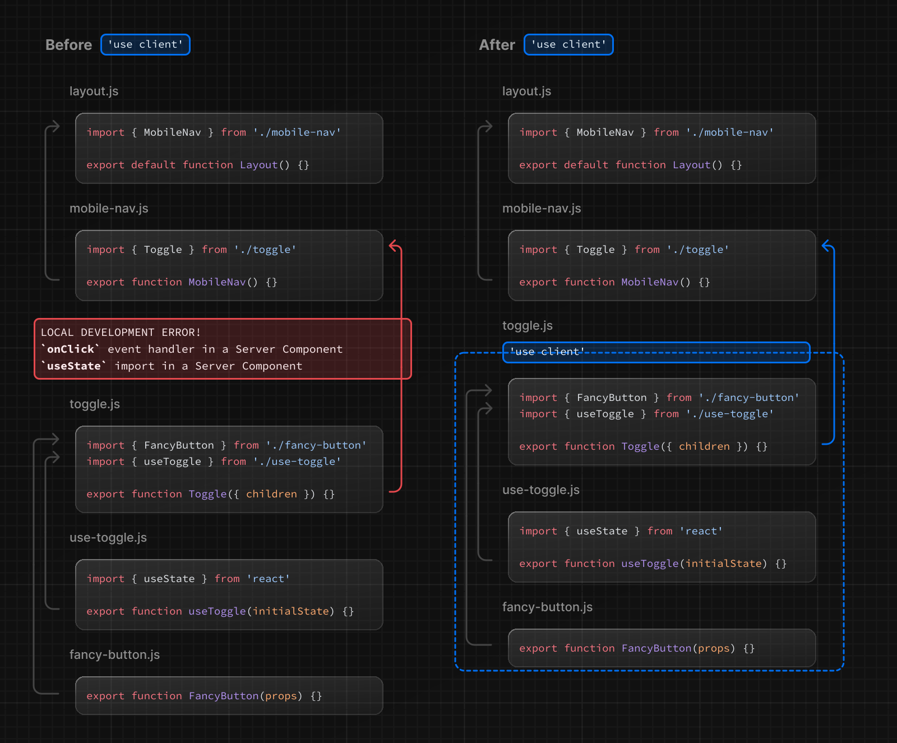

Client Components を使用すると、リクエスト時にクライアントでレンダリングされるインタラクティブな UI を記述できます。Next.js では、クライアントレンダリングは**オプトイン**です。つまり、React がクライアントにレンダリングするコンポーネントを明示的に決定する必要があります。

このページでは、Client Components の仕組み、レンダリング方法、使用するタイミングについて説明します。

## クライアント・レンダリングの利点

クライアントでのレンダリングには、以下のような利点があります：

- **インタラクティブ性**：Client Components は、状態、エフェクト、イベント・リスナーを使用できます
- **ブラウザ API**：Client Components は、[geolocation](https://developer.mozilla.org/docs/Web/API/Geolocation_API)や[localStorage](https://developer.mozilla.org/docs/Web/API/Window/localStorage)のようなブラウザ API にアクセスでき、特定のユースケースのための UI を構築できます

## Next.js で Client Components を使う

Client Components を使用するには、React の["use client"ディレクティブ](https://ja.react.dev/reference/react/use-client)をファイルの先頭、インポートの上に追加します。

<!-- textlint-disable -->

`"use client"`は、Server Component モジュールと Client Component モジュールの[境界](/docs/app-router/building-your-application/rendering#ネットワーク境界)を宣言するために使用します。つまり、`"use client"`を定義することで、子コンポーネントを含む、そのファイルにインポートされた他のすべてのモジュールはクライアントバンドルの一部とみなされ、クライアント上で React によってレンダリングされます。

<!-- textlint-enable -->

```tsx title="app/counter.tsx"
// highlight-next-line
'use client'

import { useState } from 'react'

export default function Counter() {
  const [count, setCount] = useState(0)

  return (
    <div>
      <p>You clicked {count} times</p>
      <button onClick={() => setCount(count + 1)}>Click me</button>
    </div>
  )
}
```

下図は、ネストされたコンポーネントを示しています。`toggle.js`で`onClick`と`useState`を使用すると、`"use client"`ディレクティブが定義されていない場合、エラーが発生します。これは、デフォルトではこれらの API が利用できないサーバー上でコンポーネントがレンダリングされるためです。`toggle.js`に`"use client"`ディレクティブを定義することで、コンポーネントとその子コンポーネントを、API が利用可能なクライアント上でレンダリングするよう React に指示できます。



> **複数の`use client`のエントリーポイントを定義する**：
>
> React Component ツリーには、複数の`"use client"`エントリーポイントを定義できます。これにより、アプリケーションを複数のクライアントバンドル（またはブランチ）に分割できます。
>
> しかし、`"use client"`は、クライアントでレンダリングする必要のあるすべてのコンポーネントで定義する必要はありません。一度境界を定義すると、そこにインポートされたすべての子コンポーネントやモジュールはクライアントバンドルに含まれるとみなされます。

## Client Components はどのようにレンダリングされるのか？

<!-- textlint-disable -->

Next.js では Client Components のレンダリングは、リクエストがフルページロード（アプリケーションへの初回アクセス、またはブラウザの更新をトリガーとするページのリロード）の一部であるか、後続のナビゲーションであるかによって異なります。

<!-- textlint-enable -->

### フルページロード

<!-- textlint-disable -->

最初のページロードを最適化するために、Next.js は React の API を使用して Client Components と Server Components の両方をサーバー上に静的な HTML プレビューとしてレンダリングします。つまり、ユーザーがアプリケーションへ最初にアクセスしたとき、クライアントが Client Component の JavaScript バンドルをダウンロード、解析、実行するのを待つことなく、すぐにページのコンテンツが表示されます。

<!-- textlint-enable -->

サーバー上で：

1. React は、Server Components を**React Server Component Payload（RSC ペイロード）**と呼ばれる特殊なデータ形式にレンダリングします
2. Next.js は、RSC ペイロードと Client Components の JavaScript の処理を使用して、サーバー上で**HTML**をレンダリングします

次にクライアント上で：

1. HTML は、ルートの高速な非インタラクティブなプレビューを表示するために使用されます
2. React Server Components Payload は、クライアントとサーバーのコンポーネントツリーを一致させ、DOM を更新するために使用されます
<!-- textlint-disable -->
3. JavaScript の処理は、Client Components を[ハイドレート](https://ja.react.dev/reference/react-dom/client/hydrateRoot)し、アプリケーションをインタラクティブにするために使用されます
<!-- textlint-enable -->

> **ハイドレーションとは何か**？
>
> ハイドレーションとは、静的な HTML をインタラクティブにするために、DOM にイベントリスナーをアタッチする処理のことです。舞台裏では、ハイドレーションは[hydrateRoot](https://ja.react.dev/reference/react-dom/client/hydrateRoot) React API で行われます。

### その後のナビゲーション

その後のナビゲーションでは、Client Components は、サーバーでレンダリングされた HTML を使用せずに、完全にクライアント上でレンダリングされます。

つまり、Client ComponentsJavaScript バンドルがダウンロードされ、解析されます。バンドルの準備ができたら、React は RSC ペイロードを使ってクライアントとサーバーのコンポーネントツリーを調整し、DOM を更新します。

## サーバー環境に戻る

`"use client"` 境界を宣言した後で、サーバー環境に戻りたい場合があります。例えば、クライアントのバンドルサイズを小さくしたい、サーバーでデータを取得したい、サーバーでしか利用できない API を使いたいなどです。

<!-- textlint-disable -->

Client Components と Server Components および [Server Actions](/docs/app-router/building-your-application/data-fetching/server-actions-and-mutations) を組み合わせて、Client Components 内でネストしたコードをサーバー上に保持できます。詳細は[構成パターン](/docs/app-router/building-your-application/rendering/composition-patterns)を参照してください。

<!-- textlint-enable -->
