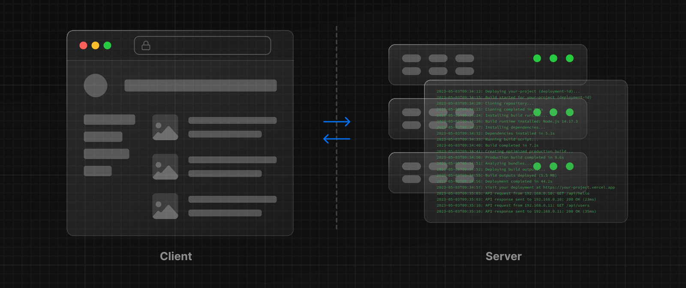

レンダリングは、書いたコードをユーザーインターフェイスに変換します。React と Next.js を使用すると、コードの一部をサーバーまたはクライアントでレンダリングできるハイブリッド Web アプリケーションを作成できます。このセクションでは、これらのレンダリング環境、ストラテジー、ランタイムの違いを理解するのに役立ちます。

---

## 基礎

手始めに、ウェブの基礎となる 3 つの概念について知っておくと役に立ちます：

- アプリケーションコードが実行される[環境](#レンダリング環境)：サーバーとクライアント
- ユーザーがアプリケーションにアクセスしたり、対話したりするときに開始される[リクエストとレスポンスのライフサイクル](#リクエストとレスポンスのライフサイクル)
- サーバーとクライアントのコードを分離する[ネットワーク境界](#ネットワーク境界)

### レンダリング環境

アプリケーションがレンダリングされる環境には、クライアントとサーバーの 2 つがあります。

- **クライアント**とは、アプリケーションコードに対するリクエストをサーバーに送信する、ユーザーのデバイス上のブラウザのことです。そしてサーバーからのレスポンスを、ユーザーが操作できるインターフェースに変換します。
- **サーバー**とは、あなたのアプリケーションコードを保存し、クライアントからのリクエストを受け取って計算処理を行い、適切なレスポンスを返すデータセンターにあるコンピュータのことを指します。

歴史的に、開発者はサーバーとクライアント用にコードを書くときに、異なる言語（JavaScript、PHP など）とフレームワークを使わなければなりませんでした。React では、開発者は**同じ言語**（JavaScript）と**同じフレームワーク**（Next.js やお好みのフレームワークなど）を使うことができます。この柔軟性により、コンテキストを切り替えることなく、両方の環境に対してシームレスにコードを書くことができます。

<!-- textlint-disable -->

しかし、それぞれの環境には独自の機能と制約があります。そのため、サーバー用とクライアント用に書くコードは必ずしも同じではありません。ある種の操作（データの取得やユーザーの状態の管理など）には、どちらか一方の環境が適しているものがあります。

<!-- texltint-enable -->

これらの違いを理解することが、React と Next.js を効果的に使うための鍵です。[Server Components](/docs/app-router/building-your-application/rendering/server-components)と[Client Components](/docs/app-router/building-your-application/rendering/client-components)のページで、その違いと使用例について詳しく説明します。本章では、まず土台を固めていきましょう。

### リクエストとレスポンスのライフサイクル

大まかに言うと、すべてのウェブサイトは以下の**リクエストとレスポンスのライフサイクル**に従います：

1. **ユーザーアクション**：ユーザーがウェブアプリケーションと対話します。リンクをクリックしたり、フォームを送信したり、ブラウザのアドレスバーに直接 URL を入力したりします
2. **HTTP リクエスト**：クライアントは[HTTP](https://developer.mozilla.org/docs/Web/HTTP)リクエストをサーバーに送信します。リクエストにはどのリソースが要求されているか、どのメソッドが使われているか（例：`GET`、`POST`）、必要であれば追加データなど、必要に応じた情報が含まれています
3. **サーバー**：サーバーはリクエストを処理し、適切なリソースで応答します。このプロセスには、ルーティングやデータのフェッチなど、いくつかのステップがあります
4. **HTTP レスポンス**：リクエストを処理した後、サーバーは HTTP レスポンスをクライアントに送り返します。このレスポンスには、ステータスコード（リクエストが成功したかどうかをクライアントに伝える）とリクエストされたリソース（HTML、CSS、JavaScript、静的アセットなど）が含まれます
5. **クライアント**：クライアントはリソースを解析し、ユーザーインターフェースをレンダリングします
6. **ユーザーアクション**：ユーザーインターフェイスがレンダリングされると、ユーザーはそれを操作することができ、その後、ここまでのライフサイクルのプロセスが再び始まります

ハイブリッド Web アプリケーションを構築する上で重要なのは、ライフサイクルの中でどのように作業を分担するか、そしてネットワーク境界をどこに配置するかを決めることです。

### ネットワーク境界

ウェブ開発において、**ネットワーク境界**は異なる環境を隔てる概念的な境界線です。例えば、クライアントとサーバー、サーバーとデータストアなどを分けることができます。

React では、クライアントとサーバーのネットワーク境界をどこに配置するかは、それが最も理にかなっている場所であればどこでも選択できます。

舞台裏では、作業は**クライアント・モジュール・グラフ**と**サーバー・モジュール・グラフ**の 2 つの部分に分かれます。サーバー・モジュール・グラフには、サーバー上でレンダリングされるすべてのコンポーネントが含まれ、クライアント・モジュール・グラフには、クライアント上でレンダリングされるすべてのコンポーネントが含まれます。

モジュール・グラフは、アプリケーション内のファイルがどのように互いに依存しているかを視覚的に表現したものだと考えるとよいでしょう。

境界を定義するには、React の`"use client"`規約を使用します。また`"use server"`という規約もあり、これは React に対してクライアント上の処理をサーバー上で行うように指示します。

## ハイブリッドアプリケーションの構築

このような環境で作業する場合、アプリケーションのコードの流れを**一方向**と考えることが役に立ちます。つまり、レスポンスの間、アプリケーションのコードは一方向に流れます。

クライアントからサーバーにアクセスする必要がある場合は、同じリクエストを再利用するのではなく、サーバーに**新しい**リクエストを送ります。このため、コンポーネントをレンダリングする場所や、ネットワーク境界を配置する場所を理解しやすくなります。

実際には、このモデルは開発者に、結果をクライアントに送信してアプリケーションをインタラクティブにする前に、まずサーバーで実行したいことを考えるように促します。

このコンセプトは、同じコンポーネントツリー内で[クライアントとサーバーのコンポーネントをどのように混在させる](/docs/app-router/building-your-application/rendering/composition-patterns)ことができるかを見れば、より明確になるでしょう。

- [Server Components](/docs/app-router/building-your-application/rendering/server-components): React Server Components を使用して、アプリケーションの一部をサーバー上でレンダリングする方法を紹介します
- [Client Components](/docs/app-router/building-your-application/rendering/client-components): Client Components を使用して、アプリケーションの一部をクライアントにレンダリングする方法を紹介します
- [構成パターン](/docs/app-router/building-your-application/rendering/composition-patterns)： Server Components と Client Components の推奨使用パターン
- [Edge / Node.js ランタイム](/docs/app-router/building-your-application/rendering/edge-and-nodejs-runtimes)：Next.js の切り替え可能なランタイム（Edge と Node.js）について紹介します
