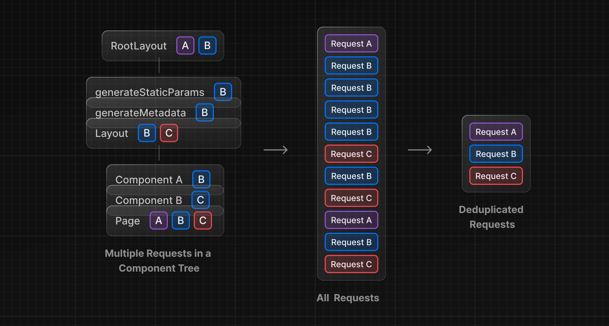

Next.js は、レンダリングやデータリクエストをキャッシュすることで、アプリケーションのパフォーマンスを向上させ、コストを削減します。このページでは、Next.js のキャッシュの仕組み、設定に使用できる API、およびそれらの相互作用について詳しく説明します。

> **Good to know**: このページは、Next.js がどのように動作しているかを理解するのに役立ちますが、Next.js で生産性を上げるために必須の知識ではありません。Next.js がキャッシュをするかどうか判断する際は、ほとんどが API の使用状況によって決定され、ゼロまたは最小限の設定で最高のパフォーマンスが得られるようにデフォルトが設定されています。

---

## 概要

ここでは、さまざまなキャッシングの仕組みとその目的について大まかに説明します：

| 仕組み                                      | 何を                   | 場所   | 目的                                                   | キャッシュ期間                       |
| ------------------------------------------- | ---------------------- | ------ | ------------------------------------------------------ | ------------------------------------ |
| [Request Memoization](#request-memoization) | 関数の返り値           | Server | React Component のツリーでデータを再利用する           | リクエストごとのライフサイクル       |
| [Data Cache](#data-cache)                   | データ                 | Server | ユーザーリクエストとデプロイメントをまたぐデータの保存 | 永続的（再検証可能）                 |
| [Full Route Cache](#full-route-cache)       | HTML と RSC ペイロード | Server | レンダリングコストの削減とパフォーマンスの向上         | 永続的（再検証可能）                 |
| [Router Cache](#router-cache)               | RSC ペイロード         | Client | ナビゲーション時のサーバーリクエストを減らす           | ユーザー・セッションまたは時間ベース |

デフォルトでは、Next.js はパフォーマンス向上とコスト削減のため、可能な限りキャッシュします。つまり、オプトアウトしない限り、ルートは静的にレンダリングされ、データリクエストはキャッシュされます。下の図はデフォルトのキャッシュ動作を示しています。ビルド時にルートが静的にレンダリングされるときと、静的ルートが最初にアクセスされるときです。

<!-- TODO: add image -->
<!--  -->

キャッシュの動作は、ルートが静的にレンダリングされるか動的にレンダリングされるか、データがキャッシュされるかキャッシュされないか、リクエストが最初の訪問の一部であるか後続のナビゲーションであるかによって変わります。ユースケースに応じて、個々のルートとデータリクエストのキャッシュ動作を設定できます。

---

## リクエストのメモ化

React は[`fetch` API](#fetch)を拡張し、同じ URL とオプションを持つリクエストを自動的に**メモ化**します。つまり、React Component ツリー内の複数の場所で、同じデータに対する `fetch` 関数を呼び出すことができます。



例えば、ルート全体（レイアウト、ページ、複数のコンポーネントなど）で同じデータを使用する必要がある場合、ツリーの先頭でデータをフェッチし、コンポーネント間でプロップを転送する必要はありません。その代わりに、同じデータに対してネットワークを介して複数のリクエストを行うことによるパフォーマンスへの影響を心配することなく、それを必要とするコンポーネントでデータをフェッチできます。

```tsx title="app/example.tsx"
async function getItem() {
  // fetch 関数は自動的にメモ化され、結果はキャッシュされる
  const res = await fetch('https://.../item/1')
  return res.json()
}

// この関数は2回呼び出されるが、実行されるのは最初の1回だけである。
const item = await getItem() // cache MISS

// 2回目の呼び出しは、ルート上のどこでも可能である
const item = await getItem() // cache HIT
```

**リクエストのメモ化の仕組み**

<!-- TODO: add image -->
<!--  -->

- ルートをレンダリングしている間、特定のリクエストが最初に呼び出されたとき、その結果はメモリになくキャッシュ `MISS` となる
- したがって、関数が実行され、データが外部ソースから取得され、結果がメモリに格納される
- 同じレンダリングパスのリクエストの後続の関数呼び出しはキャッシュ `HIT` となり、関数を実行せずにメモリからデータが返される
- ルートがレンダリングされ、レンダリングパスが完了すると、メモリは"リセット"され、すべてのリクエストのメモ化エントリはクリアされる

> **Good to know**:
>
> - リクエストのメモ化は React の機能であり、Next.js の機能ではない。他のキャッシュ機構とどのように相互作用するかを示すために、ここに含まれている
> - メモ化は `fetch` リクエストの `GET` メソッドにのみ適用される
>   - メモ化は React Component ツリーにのみ適用される：
>   - `generateMetadata`、`generateStaticParams`、Layouts、Pages、その他の Server Component の `fetch` リクエストに適用される。ルートハンドラは React コンポーネントツリーの一部ではないので、`fetch`リクエストには適用されない
> - `fetch`が適切でない場合（データベースクライアント、CMS クライアント、GraphQL クライアントなど）には、[React `cache` function](#react-cache-function) を使用して関数をメモすることができます

### キャッシュ期間

キャッシュは、サーバーリクエストの寿命と同様に React Component ツリーのレンダリングが完了するまで保持されます。

### 再検証

メモ化はサーバーリクエスト間で共有されることはなく、レンダリング中にのみ適用されるので再検証する必要はありません。

### オプトアウト

`fetch` リクエストのメモ化を無効にするには、 `AbortController` `signal` をリクエストに渡します。

```ts title="app/example.js"
const { signal } = new AbortController()
fetch(url, { signal })
```

## データ・キャッシュ

Next.js にはビルドインのデータ・キャッシュがあり、**受信するサーバーリクエスト**や**デプロイメント**にまたがってデータフェッチの結果を**永続化**します。これは、Next.js がネイティブの`fetch`API を拡張して、サーバー上の各リクエストが独自の永続キャッシュセマンティクスを設定できるようにしたためです。

> **Good to know**: ブラウザでは、`fetch`の`cache`オプションは、リクエストがブラウザの HTTP キャッシュとどのようにやりとりするかを示します。Next.js では、cache オプションは、サーバーサイドのリクエストがサーバー上のデータキャッシュとどのようにやりとりするかを示します。

**データ・キャッシュの仕組み**

<!-- TODO: add image -->
<!--  -->

- レンダリング中に`fetch`リクエストが最初に呼び出されると、Next.js はデータ・キャッシュにキャッシュされたレスポンスがないかチェックする
- キャッシュされたレスポンスが見つかれば、すぐに返され、メモ化される
- キャッシュされたレスポンスが見つからない場合は、データソースにリクエストが行われ、その結果がデータキャッシュに格納され、メモ化される
- キャッシュされていないデータ（例：`{ cache: 'no-store' }`）の場合、結果は常にデータソースから取得され、メモ化される
- データがキャッシュされていてもキャッシュされていなくても、リクエストは常にメモ化され、React レンダーパスの間に同じデータに対して重複したリクエストが行われるのを防ぐ

> **データ・キャッシュとリクエストのメモ化の違い**
>
> どちらのキャッシュ・メカニズムも、キャッシュされたデータを再利用することでパフォーマンスを向上させるのに役立ちますが、データ・キャッシュは、リクエストの受信とデプロイメントにわたって永続的であるのに対し、メモ化はリクエストの有効期間しか持続しません。
>
> メモ化では、レンダリングサーバーからデータキャッシュサーバー（CDN やエッジネットワークなど）やデータソース（データベースや CMS など）までのネットワーク境界を越えなければならない、同じレンダーパスの重複リクエストの数を減らすことができます。データキャッシュを使用することで、オリジンのデータソースへのリクエスト数を減らすことができます。

### キャッシュ期間

データ・キャッシュは、再検証またはオプトアウトを行わない限り、受信したリクエストとデプロイメントにわたって永続的です。

### 再検証

キャッシュされたデータは、以下の 2 つの方法で再検証できます：

- **時間ベースの再検証**： 一定時間が経過し、新しいリクエストが行われた後にデータを再検証する。これは、変更頻度が低く、鮮度がそれほど重要でないデータに有効
- **オンデマンドの再検証**： イベント（フォーム送信など）に基づいてデータを再検証する。オンデマンドな再検証では、タグベースまたはパスベースのアプローチを使用して、データのグループを一度に再検証する。これは、最新のデータをできるだけ早く表示したい場合に有効（ヘッドレス CMS のコンテンツが更新された場合など）

**時間ベースの再検証**

一定間隔でデータを再検証するには、`fetch`の`next.revalidate`オプションを使用して、リソースのキャッシュ有効期間（秒）を設定します。

```ts
// 1時間ごとに再検証する
fetch('https://...', { next: { revalidate: 3600 } })
```

あるいは、[Route Segment Config](#segment-config-options)オプションを使用して、Segment 内すべての`fetch`リクエストを設定したり、`fetch`を使用できない場合に設定できます。

## フル・ルート キャッシュ

## ルーターのキャッシュ
