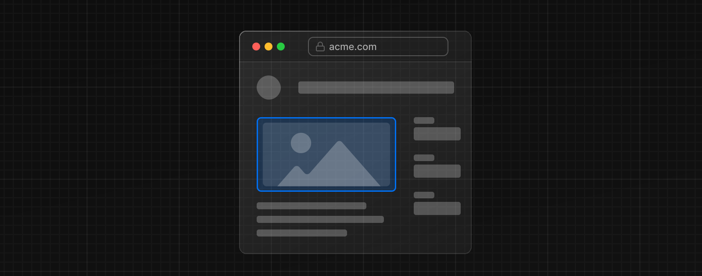
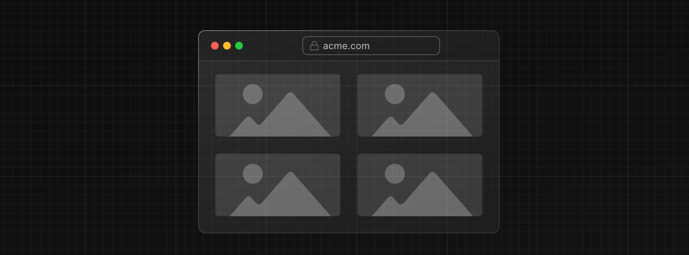
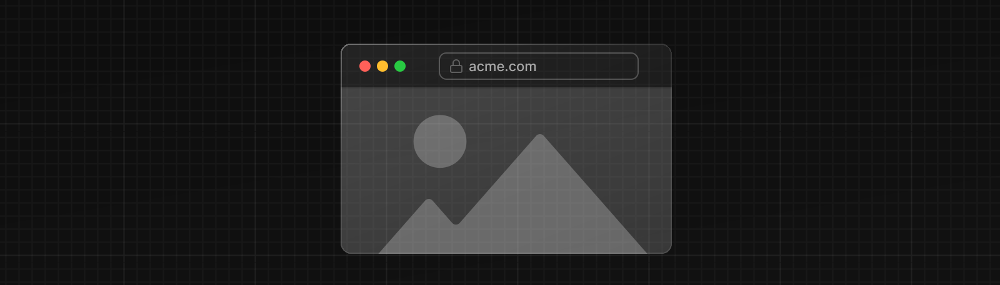

<details>  
  <summary>例</summary>  
  <div>
    <a href="https://github.com/vercel/next.js/tree/canary/examples/image-component">Image Component</a>
  </div>  
</details>

[Web Almanac](https://almanac.httparchive.org/)によると、画像は一般的なウェブサイトの[ページウェイト](https://almanac.httparchive.org/en/2022/page-weight#content-type-and-file-formats)の大部分を占めており、ウェブサイトの[LCP パフォーマンス](https://almanac.httparchive.org/en/2022/performance#lcp-image-optimization)に大きな影響を与える可能性があります。

Next.js Image コンポーネントは、HTML の``要素を拡張し、画像を自動的に最適化する機能を備えています：

- **サイズの最適化：**WebP や AVIF のような最新の画像フォーマットを使用して、各デバイス用に正しいサイズの画像を自動的に提供します
- **視覚的安定性：**画像の読み込み時に自動的に[レイアウトシフト](https://nextjs.org/learn/seo/web-performance/cls)が起こらないようにする
- **ページ読み込みの高速化：**画像はブラウザネイティブの LazyLoad を使用して、ビューポートに入ったときにのみ読み込まれます。オプションでブラーを入れることもできます
- **アセットの柔軟性：**リモートサーバーに保存された画像もオンデマンドでリサイズ可能です

> **🎥 Watch:** `next/image`の使い方はこちら → [YouTube（9 分）](https://youtu.be/IU_qq_c_lKA)

## 使用方法

```tsx
import Image from 'next/image'
```

そして、画像（ローカルまたはリモート）の`src`を定義できます。

### ローカルの画像

ローカル画像を使用するには、`.jpg`、`.png`、または`.webp`画像ファイルを`import`します。

Next.js は、インポートされたファイルに基づいて、画像の幅と高さを[自動的に決定](#画像サイズの指定)します。これらの値は、画像の読み込み中に[累積レイアウトシフト](https://nextjs.org/learn/seo/web-performance/cls)の発生を防ぐために使用されます。

```tsx title="app/page.js"
import Image from 'next/image'
import profilePic from './me.png'

export default function Page() {
  return (
    <Image
      src={profilePic}
      alt="Picture of the author"
      // width={500} 自動的に提供される
      // height={500} 自動的に提供される
      // blurDataURL="data:..." 自動的に提供される
      // placeholder="blur" // Optional: ローディング中にぼかす
    />
  )
}
```

> **注意：** 動的な`await import()`や`require()`はサポートされて*いません*。ビルド時に解析できるように、`import`は静的に行われている必要があります。

### リモートの画像

リモート画像を使用するには、`src`プロパティに URL 文字列を指定します。

Next.js はビルドプロセス中にリモートファイルへアクセスできないため、[`width`](/docs/app-router/api-reference/components/image#width)、[`height`](/docs/app-router/api-reference/components/image#height)、およびオプションの[`blurDataURL`](/docs/app-router/api-reference/components/image#blurdataurl)属性を指定する必要があります。

`width`と  `height`属性は、画像の正しい縦横比を推測し、画像の読み込みによるレイアウトシフトを避けるために使われます。`width`と  `height`は、画像ファイルのレンダリングサイズを決定するものでは*ありません*。画像のサイズについては[こちら](#画像サイズの指定)を参照してください。

```tsx title="app/page.js"
import Image from 'next/image'

export default function Page() {
  return (
    <Image
      src="https://s3.amazonaws.com/my-bucket/profile.png"
      alt="Picture of the author"
      width={500}
      height={500}
    />
  )
}
```

画像の最適化を安全に許可するには、`next.config.jsで`サポートする URL パターンのリストを定義します。悪意のある利用を防ぐため、できるだけ具体的に記述してください。例えば、以下の設定は特定の AWS S3 バケット内にある画像のみを許可します：

```tsx title="next.config.js"
module.exports = {
  images: {
    remotePatterns: [
      {
        protocol: 'https',
        hostname: 's3.amazonaws.com',
        port: '',
        pathname: '/my-bucket/**',
      },
    ],
  },
}
```

`remotePatterns`の設定については[こちら](/docs/app-router/api-reference/components/image#remotepatterns)を参照してください。画像の`srcに`相対 URL を使いたい場合は、[`loader`](/docs/app-router/api-reference/components/image#loader)を使用します。

### ドメイン

リモート画像を最適化したい場合でも、ビルトインの画像最適化 API を使用したい場合があります。その場合は、`loader`をデフォルト設定のままにして、Image の`src`属性に絶対 URL を入力します。

悪意のあるユーザーからアプリケーションを保護するには、`next/image`コンポーネントで使用するリモートホスト名のリストを定義する必要があります。

> `remotePatterns`の設定については[こちら](/docs/app-router/api-reference/components/image#remotepatterns)を参照してください

### Loaders

[先ほどの例](#リモートの画像)では、リモート画像に対して部分的な URL（`"/me.png"`）が与えられていることに注意してください。これは loader のアーキテクチャにより可能になっています。

loader は画像の URL を生成する関数です。与えられた`src`  を変更し、異なるサイズの画像をリクエストするための複数の URL を生成します。これらの複数の URL は[srcset](https://developer.mozilla.org/en-US/docs/Web/API/HTMLImageElement/srcset)の自動生成に使用され、サイト訪問者のビューポートに適したサイズの画像が提供されます。

Next.js アプリケーションのデフォルトの loader は、ビルトインの画像最適化 API を使用します。この API は、ウェブ上のどこからでも画像を最適化し、Next.js の Web サーバーから直接画像を提供します。CDN や画像サーバーから直接画像を提供したい場合は、数行の JavaScript で独自の loader 関数を書くことができます。

[`loader`](/docs/app-router/api-reference/components/image#loader)属性で、画像ごとに loader を定義することも、[`loaderFile`](/docs/app-router/api-reference/components/image#loaderfile)設定でアプリケーション・レベルでも定義できます。

## 優先順位

各ページの[LCP（Largest Contentful Paint）要素](https://web.dev/lcp/#what-elements-are-considered)となる画像に、 `priority`プロパティを追加するべきです。そうすることで、Next.js が（preload タグや Priority Hints などを通じて）特別に画像を優先的に読み込むようになり、LCP が劇的に向上します。

LCP 要素は通常、ページのビューポート内に表示される最大の画像またはテキスト・ブロックです。`next dev`を実行すると、LCP 要素が`priority`属性を持たない`<Image>`の場合、コンソールに警告が表示されます。

LCP イメージを特定したら、次のように属性を追加します：

```tsx title="app/page.js"
import Image from 'next/image'
import profilePic from '../public/me.png'

export default function Page() {
  return <Image src={profilePic} alt="Picture of the author" priority />
}
```

優先順位についての詳細は[`next/image`コンポーネントのドキュメント](/docs/app-router/api-reference/components/image#priority)を参照してください。

## 画像サイズの指定

画像がパフォーマンスを低下させるよくある原因のひとつに、_レイアウトシフト_ があります。このパフォーマンスの問題は、[Cumulative Layout Shift（累積レイアウトシフト）](https://web.dev/cls/)と呼ばれる独自の Core Web Vital を持つほど、ユーザーにとって厄介な問題です。画像によるレイアウトシフトを避けるには、[画像のサイズを常に指定すること](https://web.dev/optimize-cls/#images-without-dimensions)です。こうすることで、ブラウザは画像を読み込む前に、その画像に十分なスペースを確保できます。

`next/image`は好パフォーマンスを保証するように設計されているため、レイアウトシフトを助長するような使い方はできず、以下のいずれかの方法でサイズを指定する必要があります：

1. [static import](#ローカルの画像) を使って自動的に行う
2. [`width`](/docs/app-router/api-reference/components/image#width)と[`height`](/docs/app-router/api-reference/components/image#height)属性を使って明示的に行う
3. [`fill`](/docs/app-router/api-reference/components/image#fill)を使って、親要素いっぱいに広げることで暗黙的に行う

> _画像のサイズがわからない場合は？_
>
> サイズがわからない画像にアクセスする必要がある場合、いくつかできることがあります：
>
> **`fill` を使用する**
>
> [`fill`](/docs/app-router/api-reference/components/image#fill)属性によって、画像が親要素によってサイズ調整されます。CSS を使用して、画像の親要素にページ上のスペースを与え、メディアクエリのブレークポイントに合うように[`sizes`](/docs/app-router/api-reference/components/image#sizes)属性を指定することを検討してください。また、`fill`、`contain`、`coverを`使った[`object-fit`](https://developer.mozilla.org/en-US/docs/Web/CSS/object-fit)や、[`object-position`](https://developer.mozilla.org/en-US/docs/Web/CSS/object-position)を使って、画像がそのスペースをどのように占めるべきかを定義することもできます。
>
> **画像を正規化する**
>
> 管理しているソースから画像を提供している場合、画像を特定のサイズに正規化するために画像パイプラインを修正することを検討してください。
>
> **API コールを修正する**
>
> アプリケーションが（CMS などの）API コールを使って画像の URL を取得している場合、URL と一緒に画像の寸法を返すように API コールを修正できるかもしれません。

画像のサイズを調整するために、どの方法もうまくいかない場合、`next/image`コンポーネントは、標準的な``要素と並んでページ上でうまく機能するように設計されています。

## スタイリング

Image コンポーネントのスタイリングは、通常の``要素のスタイリングと似ていますが、いくつか注意すべきガイドラインがあります：

- `styled-jsxではなく`、`className`または`styleを`使用する
  - ほとんどの場合、`className`を使用することをお勧めします。これは、インポートされた[CSS モジュール](/docs/app-router/building-your-application/styling/css-modules)、[グローバル・スタイルシート](/docs/app-router/building-your-application/styling/css-modules#global-styles)です
  - また`style`属性を使ってインラインスタイルを割り当てることもできます
  - [styled-jsx](/docs/app-router/building-your-application/styling/css-in-js)は現在のコンポーネントにスコープされるため使用できません（スタイルを`global`としてマークしない限り）
- `fill`を使用する場合、親要素は`position: relative`でなければなりません
  - これは、そのレイアウトモードで画像要素を適切に描画するために必要です
- `fill`を使用する場合、親要素は`display: block`でなければなりません
  - これは`<div>`要素のデフォルトですが、そうでない場合は指定する必要があります

## 使用例

### レスポンシブ



```tsx
import Image from 'next/image'
import mountains from '../public/mountains.jpg'

export default function Responsive() {
  return (
    <div style={{ display: 'flex', flexDirection: 'column' }}>
      <Image
        alt="Mountains"
        // インポートされた画像は
        // 自動的にwidthとheightがセットされる
        src={mountains}
        sizes="100vw"
        // 画像の表示を全幅にする
        style={{
          width: '100%',
          height: 'auto',
        }}
      />
    </div>
  )
}
```

### コンテナ要素のサイズに合わせる



```tsx
import Image from 'next/image'
import mountains from '../public/mountains.jpg'

export default function Fill() {
  return (
    <div
      style={{
        display: 'grid',
        gridGap: '8px',
        gridTemplateColumns: 'repeat(auto-fit, minmax(400px, auto))',
      }}
    >
      <div style={{ position: 'relative', height: '400px' }}>
        <Image
          alt="Mountains"
          src={mountains}
          fill
          sizes="(min-width: 808px) 50vw, 100vw"
          style={{
            objectFit: 'cover', // cover, contain, none
          }}
        />
      </div>
      {/* グリッド上の他の画像 */}
    </div>
  )
}
```

### 背景画像



```tsx
import Image from 'next/image'
import mountains from '../public/mountains.jpg'

export default function Background() {
  return (
    <Image
      alt="Mountains"
      src={mountains}
      placeholder="blur"
      quality={100}
      fill
      sizes="100vw"
      style={{
        objectFit: 'cover',
      }}
    />
  )
}
```

さまざまなスタイルで使用されている Image コンポーネントの例については、[Image Component Demo](https://image-component.nextjs.gallery/)  を参照してください。

## その他の属性

[**`next/image`コンポーネントで利用可能なすべての属性を見る。**](/docs/app-router/api-reference/components/image)

## 設定

`next/image`コンポーネントと Next.js の画像最適化 API は、[`next.config.js`](/docs/app-router/api-reference/next-config-js)ファイルで設定できます。これらの設定により、[リモート画像を有効に](/docs/app-router/api-reference/components/image#remotepatterns)したり、[カスタム画像のブレークポイントを定義](/docs/app-router/api-reference/components/image#devicesizes)したり、[キャッシュ動作を変更](/docs/app-router/api-reference/components/image#キャッシュの制御)したりできます。

[**詳しくは、画像設定に関する完全な文書を参照してください。**](/docs/app-router/api-reference/components/image#設定オプション)

## API リファレンス

next/image API の詳細

/docs/app-router/api-reference/components/image
