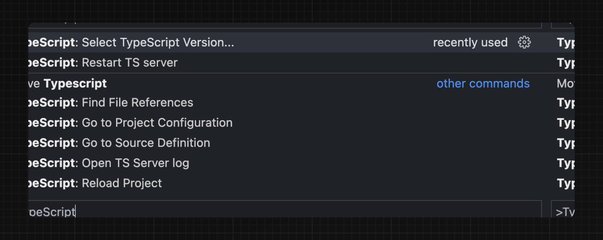

Next.jsは、Reactアプリケーションを構築するためのTypeScriptファーストな開発環境を提供します。

必要なパッケージの自動インストールと適切な設定のために、ビルドインのTypeScriptサポートが付属しています。

またエディタ用の[TypeScriptプラグイン](#typescriptプラグイン)もあります。

> **🎥 動画を見る:** 組み込みのTypeScriptプラグインについて詳しく学ぶ → [YouTube (3分)](https://www.youtube.com/watch?v=pqMqn9fKEf8)

## 新規プロジェクト

`create-next-app` は現在、デフォルトでTypeScriptと提供されます。

```bash title="Terminal"
npx create-next-app@latest
```

## 既存のプロジェクト

`.ts` / `.tsx` へのファイルの名前変更により、プロジェクトにTypeScriptを追加します。`next dev` と `next build` を実行して、必要な依存関係を自動的にインストールし、推奨される設定オプションを持つ `tsconfig.json` ファイルを追加します。

<!-- textlint-disable -->

すでに `jsconfig.json` ファイルがある場合、`jsconfig.json` から `tsconfig.json` ファイルに `paths` コンパイラオプションをコピーし、`jsconfig.json` ファイルを削除します。

<!-- textlint-enable -->

## TypeScriptプラグイン

Next.jsには、VSCodeや他のコードエディタで使用できるカスタムのTypeScriptプラグインと型チェッカーが含まれています。

VS Codeでプラグインを有効にするには、次の手順を実行します。

1. コマンドパレットを開きます（`Ctrl/⌘` + `Shift` + `P`）。
2. "TypeScript: Select TypeScript Version" を検索します。
3. "Use Workspace Version" を選択します。



これで、ファイルの編集時にカスタムプラグインが有効になります。`next build` を実行すると、カスタムの型チェッカーが使用されます。

### プラグインの機能

TypeScriptプラグインでは以下のことができます。

- [Segment 構成オプション](/docs/app-router/api-reference/file-conventions/route-segment-config)に無効な値が渡された場合に警告を表示します
- 利用可能なオプションとコンテキストのドキュメントを表示します
- `use client` ディレクティブが正しく使用されていることを確認します
- Client Component でのみ `useState` などのクライアントフックが使用されることを保証します

> **Good to know**: 将来的にはさらなる機能が追加される予定です。

## 最低限のTypeScriptバージョン

[インポート名の type 修飾子](https://devblogs.microsoft.com/typescript/announcing-typescript-4-5/#type-on-import-names) や [パフォーマンスの改善](https://devblogs.microsoft.com/typescript/announcing-typescript-4-5/#real-path-sync-native) などの文法機能を利用するために、少なくとも TypeScript の `v4.5.2` にすることを強くお勧めします。

## 静的に型付けされたリンク

`next/link`を使用してページ間を移動する際に、Next.jsではリンクに静的な型付けを行うことができます。これにより、タイポやその他のエラーを防ぐことができ、ページ間の移動時の型の安全性が向上します。

この機能を有効にするには、`experimental.typedRoutes`を有効にし、プロジェクトがTypeScriptを使用している必要があります。

```js title="next.config.js"
/** @type {import('next').NextConfig} */
const nextConfig = {
  experimental: {
    typedRoutes: true,
  },
}

module.exports = nextConfig
```

Next.jsは、アプリケーションのすべての既存のルートに関する情報を含む`.next/types`というリンク定義を生成します。これにより、TypeScriptはエディタで無効なリンクに関するフィードバックを提供できます。

現在の実験的なサポートでは、動的Segmentを含む任意の文字列リテラルがサポートされています。リテラル以外の文字列では、`href`を`as Route`として手動でキャストする必要があります。

```tsx
import type { Route } from 'next'
import Link from 'next/link'

// hrefが有効なルートの場合、TypeScriptのエラーは発生しません
<Link href="/about" />
<Link href="/blog/nextjs" />
<Link href={`/blog/${slug}`} />
<Link href={('/blog' + slug) as Route} />

// hrefが無効なルートの場合、TypeScriptのエラーが発生します
<Link href="/aboot" />
```

`next/link`をラップするカスタムコンポーネントで`href`を受け入れるには、ジェネリックを使用します。

```tsx
import type { Route } from 'next'
import Link from 'next/link'

function Card<T extends string>({ href }: { href: Route<T> | URL }) {
  return (
    <Link href={href}>
      <div>My Card</div>
    </Link>
  )
}
```

> **仕組み**
>
> `next dev`または`next build`を実行すると、Next.jsは`.next`内に隠し`.d.ts`ファイルを生成し、アプリケーションのすべての既存のルートに関する情報を含みます（リンクの`href`タイプとして有効なすべてのルート）。この`.d.ts`ファイルは`tsconfig.json`に含まれ、TypeScriptコンパイラは`.d.ts`ファイルをチェックし、エディタで無効なリンクに関するフィードバックを提供します。

## エンドツーエンドの型安全性

Next.jsのApp Routerは、**強化された型の安全性**を持っています。これには以下の要素が含まれます。

1. **フェッチ関数とページ間におけるデータのシリアライぜーションが必要ない**: コンポーネント、レイアウト、およびサーバー上のページで直接`fetch`できます。このデータはデータを文字列に変換してクライアント側のReactで使用する必要がありません。代わりに、`app`はデフォルトでServer Componentsを使用するため、`Date`、`Map`、`Set`などの値を追加の手順なしで使用できます。以前は、サーバーとクライアントの間の境界を手動でNext.js固有の型で型付けする必要がありました。
2. **コンポーネント間のデータフローの合理化**：`_app`の削除に伴い、ルートのレイアウトが優先されるようになり、コンポーネントとページ間のデータフローを視覚化することがより簡単になりました。以前は、個々の`pages`と`_app`間でデータをやり取りする際に型付けは難しく、混乱を招くバグが発生する可能性もありました。App Routerの[共有データフェッチ](/docs/app-router/building-your-application/data-fetching/fetching-caching-and-revalidating)により、この問題は解消されました。

Next.jsの[データフェッチ](/docs/app-router/building-your-application/data-fetching/fetching-caching-and-revalidating)は、データベースやコンテンツプロバイダの選択についての指示を与えずに、可能な限りエンドツーエンドの型の安全性を提供します。

通常のTypeScriptと同様に、レスポンスデータに型を付けることができます。例えば以下のようになります。

```tsx title="app/page.tsx"
async function getData() {
  const res = await fetch('https://api.example.com/...')
  // 返り値は直列化されません
  // Date、Map、Setなどを返すことができます
  return res.json()
}

export default async function Page() {
  const name = await getData()

  return '...'
}
```

完全なエンドツーエンドの型の安全性を実現するには、データベースやコンテンツプロバイダが TypeScript をサポートしている必要があります。これは[ORM](https://en.wikipedia.org/wiki/Object%E2%80%93relational_mapping)や型安全なクエリビルダを使用することによって実現できます。

## Async Server Component の TypeScript エラー

`async`な Server Component を TypeScript で使用するには、TypeScript を`5.1.3`以上、`@types/react`を`18.2.8`以上にする必要があります。

<!-- textlint-disable -->

古いバージョンの TypeScript を使用している場合、`'Promise<Element>' is not a valid JSX element`という型エラーが発生することがあります。最新バージョンのTypeScriptと`@types/react`にアップデートすることで、この問題は解決されます。

<!-- textlint-enable -->

## サーバーとClient Component間でのデータの受け渡し

サーバーとClient Component間でデータをprops経由で受け渡す場合、データは依然としてシリアライズ（文字列に変換）され、ブラウザで使用するために使用されます。ただし、特殊な型は必要ありません。他のコンポーネント間でpropsを渡すのと同じように入力された型で扱われます。

さらに、レンダリングされないデータはサーバーとクライアント間で交換されないため、シリアライズする必要がなくコードも少なくなります。これは、Server Componentのサポートが可能になったことによるものです。

## パスのエイリアスとbaseUrl

Next.jsは自動的に`tsconfig.json`の`"paths"`と`"baseUrl"`オプションをサポートします。

この機能については、[モジュールパス エイリアス](/docs/app-router/building-your-application/configuring/absolute-imports-and-module-aliases)を参照してください。

## next.config.js の型チェック

`next.config.js`ファイルはJavaScriptファイルなので、BabelやTypeScriptによって解析されることはありませんが、以下のJSDocを使用してIDEで型チェックを行えます。

```js
// @ts-check

/**
 * @type {import('next').NextConfig}
 **/
const nextConfig = {
  /* config options here */
}

module.exports = nextConfig
```

## インクリメンタルな型チェック

`v10.2.1`以降、Next.jsは[インクリメンタルな型チェック](https://www.typescriptlang.org/tsconfig#incremental)をサポートしています。これは、`tsconfig.json`で有効にすると、大規模なアプリケーションでの型チェックの高速化に役立ちます。

## TypeScriptエラーを無視する方法

TypeScriptのエラーがプロジェクトに存在する場合、Next.jsは**本番ビルド**（`next build`）に失敗します。

アプリケーションにエラーがある場合でも、Next.jsに修正を無視させて本番コードを生成する場合は、ビルドインの型チェックのステップを無効にできます。

無効にする場合、ビルドまたはデプロイプロセスの一部として型チェックを実行していることを確認してください。そうでない場合は、非常に危険です。

`next.config.js`を開き、`typescript`構成の`ignoreBuildErrors`オプションを有効にします。

```js title="next.config.js"
module.exports = {
  typescript: {
    // !! WARN !!
    // プロジェクトに型エラーがある場合でも、本番ビルドを正常に完了させるようにします。
    // !! WARN !!
    ignoreBuildErrors: true,
  },
}
```

## カスタムの型定義

カスタムの型を宣言する必要がある場合、`next-env.d.ts`を変更することが誘惑されるかもしれません。しかし、このファイルは自動生成されるため、行った変更は上書きされてしまいます。代わりに、新しいファイルを作成し、`new-types.d.ts`とし、`tsconfig.json`で参照するようにしてください。

```json title="tsconfig.json"
{
  "compilerOptions": {
    "skipLibCheck": true
    //...省略...
  },
  "include": [
    "new-types.d.ts",
    "next-env.d.ts",
    ".next/types/**/*.ts",
    "**/*.ts",
    "**/*.tsx"
  ],
  "exclude": ["node_modules"]
}
```

## バージョンの変更

| バージョン | 変更点                                                                                                                                                  |
| ---------- | ------------------------------------------------------------------------------------------------------------------------------------------------------- |
| `v13.2.0`  | ベータ版で静的に型付けされたリンクが利用可能になりました。                                                                                              |
| `v12.0.0`  | より高速なビルドのために、TypeScriptとTSXのコンパイルはデフォルトで [SWC](/docs/app-router/architecture/nextjs-compiler) が使用されるようになりました。 |
| `v10.2.1`  | [インクリメンタルな型チェック](https://www.typescriptlang.org/tsconfig#incremental)がサポートされ、`tsconfig.json`で有効になりました。                  |
